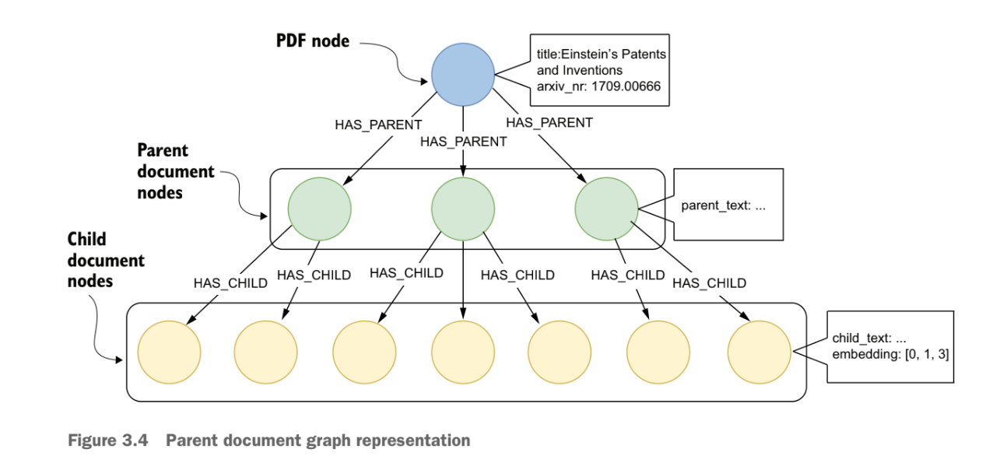

# Essential GraphRAG Quick Reference

This document is a compact reference to the most useful ideas from *Essential GraphRAG*. It keeps the main section takeaways and a small set of figures, while leaving the full synthesis to `docs/summary/GraphRAG Research Review.md`.

## Section 3 - Advanced Retrieval

- Hybrid retrieval improves recall by combining vector similarity with keyword or full-text search.
- Parent-document retrieval embeds smaller child chunks but returns a larger parent context.
- This helps preserve surrounding document meaning while still retrieving at a finer level.
- In a graph-oriented setup, the parent-child structure can be modeled explicitly.

Why it matters: these patterns improve retrieval quality before moving into heavier graph-aware workflows.

## Section 4 - Text2Cypher

- Text2cypher converts natural-language questions into Cypher queries over the graph.
- It works best when the prompt includes the graph schema, terminology mappings, format instructions, and few-shot examples.
- Few-shot examples are graph-specific and help correct recurring mistakes.
- Schema prompting is important because the model needs to understand labels, relationships, and properties.
- Text2cypher can also act as a catchall retriever when other retrieval methods are a poor fit.

Why it matters: text2cypher is the bridge from semantic retrieval to precise structured question answering.

## Section 5 - Agentic RAG

- Agentic RAG uses a retriever router to choose the best retriever or retrievers for a question.
- The core building blocks are retriever agents, a router, and an answer critic.
- Generic retrievers such as vector search and text2cypher are useful, but specialized retrievers often need to be added over time.
- Questions can be decomposed into smaller steps, and later retrieval steps can be updated using earlier answers.
- The answer critic blocks incomplete or ungrounded answers before they are returned.

Why it matters: agentic routing becomes useful when the system needs more than one retrieval path to answer questions reliably.

## Section 6 - Constructing Knowledge Graphs with LLMs

- Chunk-only retrieval can mix unrelated evidence when the question really depends on structured document context.
- LLM structured outputs are useful for extracting entities, relationships, and fields from unstructured text.
- A good graph model is still needed; LLM extraction does not replace schema design.
- Constraints and indexes matter for both graph quality and query performance.
- Entity resolution is required to merge multiple representations of the same real-world entity.

Why it matters: graph quality depends on both extraction quality and the decisions made when shaping the graph.

## Section 7 - Microsoft GraphRAG

- Microsoft GraphRAG extracts entities and relationships from chunks, then consolidates them through summarization.
- It detects graph communities and generates community summaries to support higher-level retrieval.
- Local search supports entity-focused questions by combining graph and source-text context.
- Global search uses community summaries to answer broad thematic questions across the corpus.
- Ranking is needed to keep entities, relationships, chunks, and communities manageable at query time.

Why it matters: Microsoft GraphRAG is especially useful for local-to-global reasoning over large text corpora.

## Section 8 - Evaluation

- A GraphRAG system needs end-to-end benchmark questions and grounded reference answers.
- Dynamic ground truth is useful when the underlying knowledge base changes over time.
- RAGAS-style metrics highlighted in the source material are context recall, faithfulness, and answer correctness.
- Evaluation should look beyond answer fluency and check whether the system retrieved the right evidence and stayed grounded in it.

Why it matters: evaluation is what tells you whether a more complex GraphRAG design is actually better than simpler retrieval.

## Key Takeaways

- Start with strong retrieval basics such as hybrid search and better chunk-context handling.
- Use text2cypher when exact graph queries or aggregation matter.
- Add agentic routing when the question mix requires multiple retrieval strategies.
- Treat graph construction and entity resolution as core quality problems, not side tasks.
- Use Microsoft GraphRAG ideas selectively when summary-heavy or corpus-level retrieval is needed.
