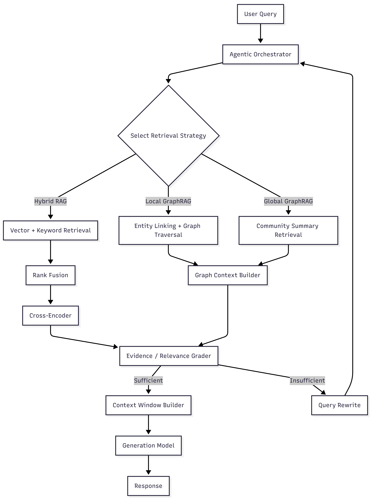

# GraphRAG Project Documentation

## 1. Executive Summary

This document summarizes the current direction, target architecture, and near-term delivery priorities for the GraphRAG project.

The project is moving toward a graph-first architecture that extends the current hybrid RAG pipeline with graph construction, graph-aware retrieval, and clearer operational workflows. The immediate goal is to define a practical MVP path, document the architecture clearly, and choose an implementation environment that supports both short-term delivery and long-term growth.

The current position is:

- prioritize a graph-first architecture
- treat Microsoft GraphRAG as a useful reference, not the default implementation
- choose the implementation environment before running provider or model A/B testing
- keep the system modular so retrieval and orchestration can evolve over time

## 2. Scope of Deliverables

Current deliverables focus on documentation, architecture, workflow definition, MVP planning, and environment selection support.

### Core deliverables

- client-facing project documentation
- current and planned workflow documentation
- GraphRAG direction and rationale
- high-level architecture proposal
- admin MVP definition for ingestion at scale
- environment comparison and recommendation
- immediate next-step plan

### Priority workstreams

- Task 2.2 - technical comparison of AI SDK, Mastra, and LangGraph
- Task 4.1 - MVP admin features for large-scale ingestion

## 3. Current State

The current system is a document-driven hybrid RAG pipeline. It is already stronger than simple vector search because it combines multiple retrieval and ranking steps, but it is still mostly linear and chunk-centric.

### Current workflow summary

1. Source documents are collected.
2. Documents are parsed and OCR is used where needed.
3. Text is cleaned and normalized.
4. Documents are chunked.
5. Chunks are indexed for retrieval.
6. Retrieval combines vector and keyword search.
7. Results are ranked and returned to the user.

### Current limitations

- retrieval is still centered on chunks rather than linked entities and relationships
- the workflow is mostly fixed, with limited routing by query type
- cross-document relationships, aggregation, and thematic synthesis remain difficult
- provenance and operational visibility need to become more explicit as ingestion scales

## 4. Workflow Comparison

The current system is a high-quality hybrid RAG pipeline. The proposed system builds on that foundation by adding graph construction, graph-aware retrieval, and more deliberate routing between retrieval strategies.

### Current hybrid RAG pipeline

The current prototype improves retrieval quality through:

- vector similarity search
- keyword or full-text retrieval
- rank fusion across retrieval sources
- reranking for semantic relevance
- relevance grading and optional query rewriting

This works well for factual or passage-level questions, but it still treats retrieval as one main path.

### Proposed graph-first workflow

The proposed architecture extends the current pipeline by adding:

- entity and relationship extraction
- knowledge graph construction
- community detection and summarization where useful
- multiple retrieval modes for different question types
- clearer separation between offline indexing and query-time retrieval

The system becomes more decision-driven: narrow factual questions can still use hybrid retrieval, while entity-centric and higher-level analytical questions can use graph-aware retrieval paths.

## 5. Offline GraphRAG Indexing Workflow

GraphRAG introduces an offline indexing stage that prepares graph-aware assets before query time.

### Indexing flow

1. Documents are ingested, cleaned, and split into chunks.
2. Chunks are embedded for vector retrieval.
3. Chunks are indexed for keyword or full-text search.
4. Entities and relationships are extracted from the source material.
5. A knowledge graph is built from the extracted structure.
6. The graph is analyzed to detect communities of related entities.
7. Community summaries are generated where they add retrieval value.

This stage enables the system to reason over entities, relationships, and broader themes instead of relying only on isolated chunks.

## 6. Query-Time Retrieval Workflow

At query time, the system should choose the most suitable retrieval path for the question rather than forcing every query through the same sequence.

### Query-time flow

1. A user submits a question.
2. The system identifies the best retrieval strategy for that query.
3. The selected retriever gathers context from the relevant sources.
4. Supporting evidence is assembled with traceability.
5. The system generates a grounded response.

In a more advanced version, this routing can be handled by an agentic orchestrator that chooses tools, sequences retrieval steps, and checks whether the answer is complete.

## 7. Retrieval Modes

### Hybrid RAG retrieval

Best for factual or passage-level questions where the answer appears directly in the documents.

Typical components:

- vector similarity search
- keyword or full-text retrieval
- rank fusion
- reranking

### Local GraphRAG retrieval

Best for entity-centric or relationship-heavy questions.

Typical flow:

1. identify key entities in the question
2. traverse connected nodes in the graph
3. gather linked evidence from source documents

This supports multi-hop retrieval across related entities and documents.

### Global GraphRAG retrieval

Best for broad analytical or thematic questions.

Rather than returning only chunks, this mode uses higher-level graph artifacts such as community summaries to answer questions about themes, trends, or corpus-wide patterns.

## 8. Planned Architecture

The architecture should remain modular so the team can improve retrieval quality without locking into one framework or one graph pattern too early.

### Architecture layers

#### Ingestion layer

Handles document intake, file registration, and job creation.

#### Extraction layer

Handles parsing, OCR fallback, structured content extraction, and metadata capture.

#### Processing layer

Handles cleaning, chunking, embedding preparation, entity extraction, relationship identification, and graph preparation.

#### Knowledge layer

Stores vector assets, graph structures, metadata, and provenance.

#### Retrieval layer

Combines document relevance and graph context into grounded retrieval results.

#### Admin layer

Supports batch ingestion, job visibility, operational control, and downloadable outputs.

#### Evaluation layer

Supports environment selection first, and later provider or model comparison within the selected environment.

## 9. Admin MVP - Ingestion at Scale

### Objective

Deliver an MVP admin interface that makes ingestion visible and manageable at scale, including runs up to approximately 2000 PDFs.

### Functional requirements

- upload or register documents for ingestion
- queue work as jobs
- show status per document or job
- expose failures and partial failures clearly
- allow OCR or extraction output download
- support large batch visibility
- leave room for retry and reprocessing workflows

### Why job-based processing is needed

At this scale, ingestion is multi-stage and non-instant. A single document may involve parsing, OCR, cleaning, chunking, indexing, and graph preparation. A job model makes the workflow observable and prevents the interface from blocking.

### Suggested job lifecycle

- Pending
- Queued
- Running
- Succeeded
- Partially Succeeded
- Failed
- Cancelled
- Archived

### Downloadable outputs

Useful artifacts include:

- raw OCR text
- cleaned extraction text
- extracted tables where available
- metadata summary
- processing or job summary

### Risks and constraints

- large-volume ingestion may reveal bottlenecks not seen in small tests
- OCR quality may vary significantly by document type
- extraction quality affects downstream graph quality
- admin workflows become confusing quickly if status handling is unclear

The MVP goal is operational visibility and control, not a full enterprise operations console.

## 10. Environment Comparison

The first major implementation decision is the environment, not the model provider.

### AI SDK

Best fit for faster product integration, structured outputs, tool use, and provider flexibility.

### Mastra

Relevant as a bundled TypeScript framework with workflows, RAG, memory, evals, and tracing, but not the lead recommendation right now.

### LangGraph

Best fit for explicit workflow control, stateful execution, and more complex branching retrieval pipelines.

### Comparison summary

| Option | Best fit | Strengths | Main limitation |
| --- | --- | --- | --- |
| AI SDK | Product-layer integration | lightweight, provider-flexible, strong structured outputs | lighter on orchestration by default |
| Mastra | Bundled TypeScript framework | more built-in framework surface | project fit still needs validation |
| LangGraph | Complex orchestration | strong state, branching, durable execution | heavier to adopt early |

### Recommendation

Use AI SDK as the recommended initial environment if the priority is a faster MVP with cleaner application integration. Keep LangGraph as the stronger orchestration alternative if workflow complexity grows early. Keep Mastra documented as a valid research option, but not the default path.

## 11. Evaluation Approach

The first A/B should compare environments rather than providers.

### Recommended A/B

- Option A - AI SDK-led application architecture
- Option B - LangGraph-led orchestration architecture

### Evaluation criteria

- graph-first fit
- workflow control
- product integration
- provider flexibility
- operational clarity
- long-term extensibility

### Recommended process

1. choose the environment
2. build the same narrow pilot slice in both options
3. score both against the criteria above
4. select the environment
5. run provider or model A/B testing inside the chosen environment

## 12. Immediate Next Steps

### Documentation

1. finalize client-facing structure and terminology
2. align workflow language with the merged diagram narrative
3. convert remaining open items into explicit decisions

### Admin MVP

1. define ingestion use cases
2. confirm job states and operational visibility needs
3. specify downloadable OCR and extraction outputs
4. outline a simple admin UI or workflow

### Environment selection

1. compare AI SDK and LangGraph using the same pilot scope
2. assess development clarity, graph fit, and maintainability
3. defer provider or model testing until the environment is chosen

## 13. Summary Recommendation

The recommended path is to continue with a graph-first architecture, keep the system implementation-open, use AI SDK as the initial environment for a faster MVP, and preserve the option to introduce LangGraph later if orchestration complexity grows. The immediate priority is to make the workflow, architecture, and ingestion operations clear enough to support practical implementation.
