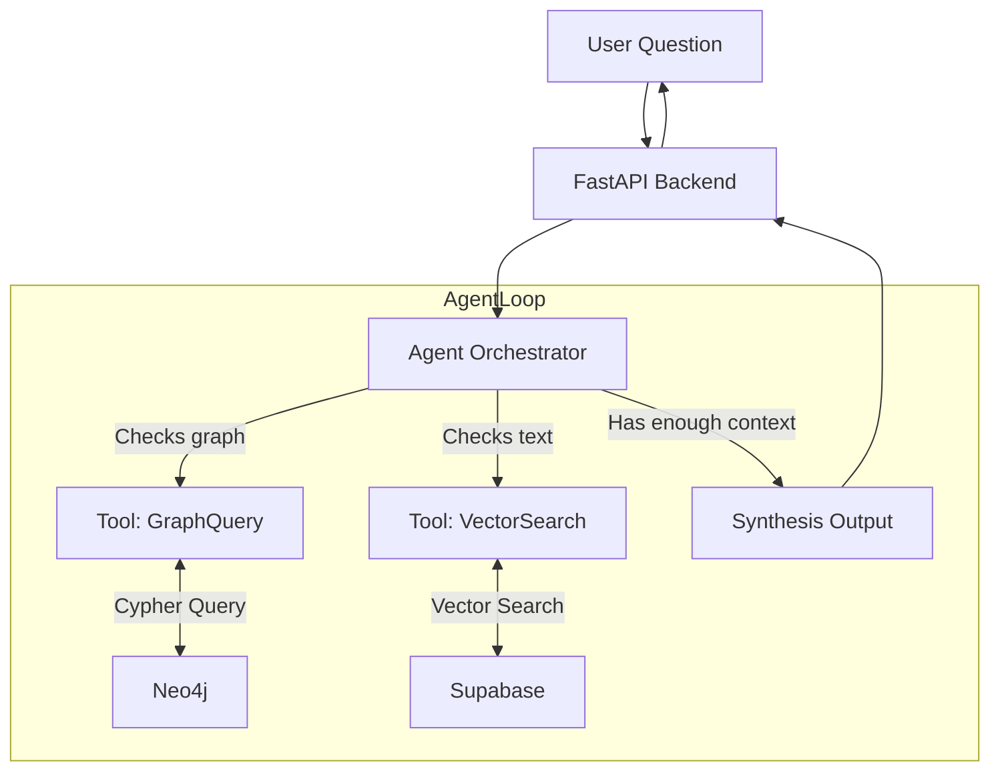

# Agentic Orchestration Architecture (RAG + Graph)

This document explains the transition from our **Current Routing Pipeline** (hardcoded classification) to an **Agentic Orchestration Architecture** utilizing both our standard Postgres/pgvector database and the new Neo4j Graph Database.

## 1. What is Agentic Orchestration?

In our current setup (see `CURRENT_RAG_PIPELINE.md`), incoming user queries are run through a static classifier that forces the query down one of three rigid paths:
1. Conversational (No Retrieval)
2. Simple Knowledge (Postgres Vector Search)
3. Complex Knowledge (Postgres Map-Reduce)

**Agentic Orchestration** replaces this rigid classifier with an "Agent" (a Large Language Model equipped with tools). Instead of following a hardcoded path, the LLM analyzes the user's question, looks at the tools available to it (e.g., `Search Documents`, `Query Knowledge Graph`), and makes dynamic decisions on which databases to query, in what order, to compile the best answer.

### Why do we need this?

Integrating a Graph Database (Neo4j) alongside a Vector Database (Postgres) creates a complex routing problem. 
- **Postgres (Vector)** is excellent at answering: *"What does the manual say about managing silverleaf whitefly?"* (Semantic text similarity).
- **Neo4j (Graph)** is excellent at answering: *"Which researchers specialize in Fusarium wilt, and what chemicals are linked to it?"* (Relational mapping, exact entity connections).

If a user asks: *"Who are the leading experts on pests affecting cotton seedlings, and what do their studies recommend?"*, the Agent can dynamically choose to:
1. Hit **Neo4j** to find the "Pests" affecting "Seedlings" and the linked "Researchers".
2. Hit **Postgres** specifically filtering for documents authored by those researchers to get their "recommendations".

## 2. The Agentic Architecture

## 3. How the Databases Work Together

By keeping the databases standalone and connecting them via the Agent, we avoid the immense technical debt of trying to perfectly sync graph nodes with text chunks at ingestion time.

### The Tools (Provided to the Agent)

1. **`Search_Manuals_Vector` (Supabase Postgres):**
   * **Input:** A semantic search string.
   * **Action:** Performs hybrid search (vector + keyword) over chunked PDFs (ACPM, CPMG).
   * **Use case:** General knowledge retrieval, paragraphs, procedures, and context.

2. **`Query_Entity_Graph` (Neo4j Aura):**
   * **Input:** Entity names (e.g., "Silverleaf Whitefly", "Spirotetramat").
   * **Action:** Traverses the graph to return structured relationships (e.g., Approved Chemicals, Resistance Risks, Researcher Profiles).
   * **Use case:** Acronym expansion, finding precise relational links, mapping pests to chemicals without hallucinating.

## 4. End-to-End Flow Example

**User Question:** *"What are the approved resistance management strategies for Silverleaf Whitefly?"*

**Step-by-step Agentic Flow:**
1. **Agent Thought:** The user is asking about a specific pest ("Silverleaf Whitefly") and "resistance management strategies". Let me check the Graph first to see what chemical groups are approved for this pest, so I have exact terminology.
2. **Action 1:** Calls `Query_Entity_Graph(entity="Silverleaf Whitefly", relationship="APPROVED_TREATMENT")`.
3. **Graph Returns:** `[Pyriproxyfen (Group 7C), Spirotetramat (Group 23)]`
4. **Agent Thought:** Now I know the specific chemicals. I will search the manuals for the specific resistance management strategies for these chemicals regarding this pest.
5. **Action 2:** Calls `Search_Manuals_Vector(query="Resistance management strategies for Pyriproxyfen and Spirotetramat on Silverleaf Whitefly")`.
6. **Vector Returns:** Relevant text chunks from the CPMG 2025.
7. **Agent Final Answer:** Synthesizes the exact structural data from the graph with the nuanced paragraph instructions from the vector DB.

## 5. Summary of Benefits

| Benefit | Description |
|---|---|
| **Reduced Hallucinations** | The LLM relies on the Graph for hard facts (chemicals, acronyms, people) and the Vector DB for general text, preventing it from mixing up standard operational procedures. |
| **Decoupled Architecture** | We do not need a complex pipeline that attempts to embed vectors directly inside Neo4j. Postgres handles vectors; Neo4j handles relationships. The Agent bridges them. |
| **Dynamic Multi-hop Reasoning** | The Agent can take the answer from Database A, and use it to formulate a better, more precise query for Database B. |
