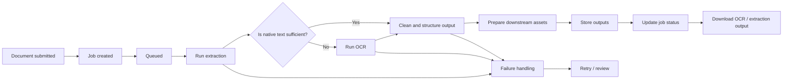

# GraphRAG: Unified Project Reference

> This document consolidates the GraphRAG book notes, research review, workflow comparison, and project documentation into a single, deduplicated reference. Content has been preserved as authored; structure has been reorganised to eliminate repetition.

---

## Table of Contents

1. [Executive Summary](#1-executive-summary)
2. [Why Standard RAG Is Not Enough](#2-why-standard-rag-is-not-enough)
3. [What Knowledge Graphs Add to RAG](#3-what-knowledge-graphs-add-to-rag)
4. [GraphRAG Patterns](#4-graphrag-patterns)
5. [System Architecture](#5-system-architecture)
   - [Offline Indexing Pipeline](#51-offline-indexing-pipeline)
   - [Query-Time Workflow](#52-query-time-workflow)
   - [Retrieval Strategies](#53-retrieval-strategies)
6. [Agentic RAG](#6-agentic-rag)
7. [Constructing Knowledge Graphs with LLMs](#7-constructing-knowledge-graphs-with-llms)
8. [Microsoft GraphRAG](#8-microsoft-graphrag)
9. [Alternative GraphRAG Approaches](#9-alternative-graphrag-approaches)
10. [Neo4j as the Primary Database](#10-neo4j-as-the-primary-database)
11. [Strategy: Microsoft GraphRAG vs Custom Implementation](#11-strategy-microsoft-graphrag-vs-custom-implementation)
12. [Environment Selection: AI SDK vs Mastra vs LangGraph](#12-environment-selection-ai-sdk-vs-mastra-vs-langgraph)
13. [Project Direction and Scope](#13-project-direction-and-scope)
14. [Admin Features — Task 4.1](#14-admin-features--task-41)
15. [Evaluation](#15-evaluation)
16. [Implementation Roadmap](#16-implementation-roadmap)
17. [Risks and Mitigations](#17-risks-and-mitigations)
18. [Open Decisions and Missing Pieces](#18-open-decisions-and-missing-pieces)
19. [Immediate Next Steps](#19-immediate-next-steps)
20. [References](#20-references)

---

## 1. Executive Summary

**GraphRAG is not one pattern, it is a family of patterns.** The right choice depends on the type of questions the system must answer.

A standard vector RAG stack is often enough for local, passage-level lookup. It becomes weaker when the system needs:

- cross-document entity linking,
- filtering, counting, sorting, and aggregation,
- multi-hop reasoning across entities and relations,
- explainability and provenance,
- corpus-level summarisation, or "what are the main themes?" style questions.

That is exactly where knowledge graphs help. Knowledge graphs are especially useful because they unify structured and unstructured data, support precise queries, and enable richer retrieval than chunk-only vector search.

The recommended position for this project:

- **GraphRAG / graph-first architecture is the primary focus.**
- **Neo4j is the recommended primary database** if the target system is genuinely graph-aware, not just vector-aware.
- **Langchain is the recommended initial environment**, with AI-SDK and Mastra being solid fully-typed LLM/Agent friendy alternative development tools, Langraph(Langcahin orchestration layer), Mastra(AI-SDK orchestration layer).
- **Workflow comes before provider and model comparison.** for solutions that rely on private data or data that is not considered withing a model training data, selecting SOTA models may not bring any substantial benefits, any model capable of interpreting the inyected context and user question, works good enough 

---

## 2. Why Standard RAG Is Not Enough

LLMs are strong generators but have hard limits around stale knowledge, hallucinations, and missing private data. RAG helps by retrieving external context at run time instead of relying only on model memory.

However, chunk-only retrieval has structural weaknesses:

- it retrieves semantically similar passages but often misses exact relationships,
- it struggles with aggregation queries,
- it struggles with entity disambiguation,
- it often loses document boundaries and source coherence,
- it is weak on dataset-wide or global questions.

**Practical implication:** if product requirements include questions like the following, vector-only RAG is usually not enough:

- "Which supplier contracts expiring in the next 90 days mention indemnity caps above $1M?"
- "Which incidents involve the same customer, product, and region as the latest escalation?"
- "Summarise the main tensions and themes across all board minutes this quarter."

The first two require structured graph reasoning. The third is where GraphRAG-style summarisation hierarchies become valuable.

---

## 3. What Knowledge Graphs Add to RAG

A knowledge graph improves RAG in five important ways:

**A. Entity grounding** — Entity mentions in text can be linked to canonical nodes. This reduces duplication and improves retrieval consistency.

**B. Multi-hop retrieval** — Graphs make it natural to traverse from one entity to related entities, events, documents, claims, or chunks.

**C. Precise filtering and aggregation** — Graphs can answer questions that require counts, joins, constraints, and path-aware filtering. Text alone cannot reliably answer these efficiently.

**D. Explainability** — A graph traversal or a set of linked nodes and relationships is easier to inspect than a purely latent vector match.

**E. Hybrid retrieval** — Graphs do not replace vectors. They complement them. The best systems typically use combinations of: vector similarity, keyword or full-text retrieval, graph traversal, structured query generation, and reranking or agentic routing.

---

## 4. GraphRAG Patterns

### Pattern 1 — Vector plus Hybrid Search

The entry point. Embed chunks, store them, retrieve by vector similarity, then add keyword search for hybrid retrieval. Hybrid retrieval is often better than pure vector retrieval because exact term matches and semantic similarity cover different failure modes.

**Best for:** FAQ assistants, policy lookup, document search, low-complexity enterprise copilots.

**Weakness:** still weak for structured reasoning and global summarisation.

### Pattern 2 — Advanced Vector Retrieval

Two important techniques:

- **Step-back prompting** rewrites a narrow question into a broader one to improve retrieval recall.
- **Parent-document retrieval** embeds smaller child chunks but returns a larger parent context. In Neo4j, this creates a graph structure connecting child chunks to a parent document, with chunking strategies based on token length.

### Pattern 3 — Text2Cypher

One of the most strategically important patterns for enterprise GraphRAG. Natural language is converted to Cypher using schema, few-shot examples, terminology mappings, and formatting constraints.

This is how a system moves from "semantic passage search" to "actual database question answering."

**Best for:** aggregation queries, structured retrieval over business graphs, explainable queries, domain-specific assistants with stable schemas.

**Main risk:** prompt fragility and schema drift. Recommended mitigations: few-shot examples, explicit schema prompts, terminology mappings.

> Text2Cypher can also function as a "catch-all" retriever for query types where no other retriever is a good match.

### Pattern 4 — Agentic GraphRAG

An agentic RAG system acts as a router over multiple retrievers, plus an answer critic. This pattern is especially useful when one retriever is never enough — for example, combining vector retrieval for unstructured context, graph traversal for neighbour discovery, text2cypher for exact structured questions, and fallback tools for simpler cases.

### Pattern 5 — Graph Construction from Unstructured Text

LLMs can extract structured outputs from text and import them into a graph. This pattern matters because many organisations do not start with a knowledge graph. They start with PDFs, emails, tickets, transcripts, policies, contracts, and reports.

### Pattern 6 — Microsoft-Style GraphRAG

A distinct branch of GraphRAG. It extracts entities and relationships, detects communities, summarises those communities, then uses global and local query modes. This is not just "graph plus vector." It is a hierarchical summarisation architecture.

---

## 5. System Architecture

### 5.1 Offline Indexing Pipeline

GraphRAG introduces an indexing pipeline that processes documents before any queries occur. This pipeline constructs the knowledge graph and community summaries used during query-time reasoning.

**Pipeline steps:**

1. Documents are cleaned and split into chunks.
2. Each chunk is embedded to create vectors stored in the vector database.
3. Chunks are also indexed using keyword search.
4. Entities and relationships are extracted to form a knowledge graph.
5. The graph is analysed to detect communities of related entities.
6. Each community is summarised into high-level topic descriptions.

These structures allow the system to reason about relationships and themes across the document corpus, rather than relying solely on individual text chunks.

> *See:* `../img/offline_indexing_draft.png` for the indexing pipeline workflow diagram.

---

### 5.2 Query-Time Workflow

When a user query arrives, the system dynamically selects the most appropriate retrieval strategy, rather than always following the same fixed sequence.

> *See:* `../img/query-time_workflow_draft.png` for the query-time workflow diagram.

The current baseline workflow (pre-GraphRAG) follows these steps:

1. A user query is entered.
2. The orchestrator sends the query to both the vector store and keyword index.
3. Retrieved results are combined using rank fusion.
4. A cross-encoder model reranks the results based on semantic relevance.
5. A relevance grader determines whether sufficient context has been retrieved.
   - **5a.** If context is insufficient, the system rewrites the query and tries again.
   - **5b.** If context is sufficient, the generation model produces the response.

This design improves retrieval quality but treats retrieval as a single structured process, with limited flexibility for different query types.

---

### 5.3 Retrieval Strategies

The proposed system selects from three retrieval strategies depending on the nature of the query.

#### Hybrid RAG Retrieval

Used for specific factual queries where document passages contain the answer.

Example queries:
- "Which trials studied bollworm resistance?"
- "What yield improvement was observed in cultivar Sicot 746B3F?"

This path uses: vector similarity search, keyword search, rank fusion, and cross-encoder reranking.

#### Local GraphRAG Retrieval

Used for queries involving relationships between entities.

Example queries:
- "How does irrigation strategy affect cotton yield?"
- "Which research programs studied drought tolerance?"

The system: identifies entities in the query, traverses related nodes in the knowledge graph, and collects supporting document evidence. This enables multi-hop reasoning across documents.

#### Global GraphRAG Retrieval

Used for high-level analytical questions.

Example queries:
- "What major themes appear across CRDC cotton research?"
- "How has drought research evolved over time?"

Instead of retrieving document chunks, the system retrieves community summaries that represent major research topics.

---

## 6. Agentic RAG

### Overview

The starting interface to an agentic RAG system is usually a retriever router, whose job is to find the best-suited retriever — or retrievers — to perform the task at hand. One common implementation uses an LLM's tool-calling (function calling) capability.

**The three foundational parts of an agentic RAG system:**

- **Retriever router** — takes in the user question and returns the best retriever(s) to use.
- **Retriever agents** — the actual retrievers that retrieve the data needed to answer the question.
- **Answer critic** — takes in the answers from the retrievers and checks whether the original question is answered correctly. This is a blocking function: it can stop an answer from being returned if it is incorrect or incomplete.

### Retriever Agents

Generic retriever agents relevant in most agentic RAG systems include vector similarity search and text2cypher. The former is useful for unstructured data; the latter for structured data in a graph database. Specialised retrievers should be built over time as the system identifies queries that generic retrievers handle poorly.

### Multi-step Query Handling

The LLM can decide to make multiple function calls to respond to a single question. One benefit of sending questions in sequence is that answers from earlier questions can be used to rewrite later ones.

> Example: "Who has won the most Oscars, and is that person alive?" can be decomposed into "Who won the most Oscars?" followed by "Is [that person] alive?" — where the second question is rewritten once the first is answered.

### Answer Critic

LLMs are non-deterministic, so errors will occur. The answer critic step is essential in a production environment to keep answer quality consistent.

### Why Use Agentic RAG?

Agentic RAG is especially useful when:
- there are a variety of data sources and the system must use the best source for each query type,
- the data source is very broad or complex and requires specialised retrievers for consistent performance.

---

## 7. Constructing Knowledge Graphs with LLMs

### Extracting Structured Data from Text

Regular vector search can pull information from different unrelated documents and assess them as relevant, when the user is actually asking something specific to one document. This undermines the relevance of the RAG pipeline. Structured extraction is the solution.

### Structured Outputs

Structured outputs are the basis for extracting information from unstructured documents. Combining structured output schemas with a well-designed system prompt guides the LLM into more accurate extraction.

> Since domain experts rather than engineers best understand what information is most important to extract, it is important to consult someone with domain knowledge and to speak with end users about the specific questions they want answered.

### Constructing the Graph

A suitable graph model should be designed upfront to represent the relationships and entities in the data.

> A well-designed graph schema uses nouns and verbs for labels and relationship types, and adjectives and nouns for properties.

Defining constraints and indexes is important to ensure the integrity of the graph and to enhance query performance.

### Entity Resolution

> Entity resolution refers to the process of identifying and merging different representations of the same real-world entity within a dataset or knowledge graph.

Techniques include string matching, clustering algorithms, and machine learning methods that use context surrounding each entity. One of the most effective strategies is to develop domain-specific ontologies or rules reflecting the particular data context.

Combining domain expertise with context-aware machine learning or clustering techniques produces a more robust and flexible approach. These mappings are knowledge-graph-specific and should be part of the prompt; they are hard to reuse between different knowledge graphs.

---

## 8. Microsoft GraphRAG

### What It Actually Is

Microsoft GraphRAG is a structured, hierarchical RAG approach that extracts a graph from raw text, builds a community hierarchy, generates community summaries, and uses those artefacts at query time. The official documentation exposes four main query modes:

- **Global Search** — for holistic corpus-level questions.
- **Local Search** — for entity-specific questions.
- **DRIFT Search** — for entity-centric search with community context.
- **Basic Search** — for standard top-k vector-style retrieval.

### Community Detection and Summarisation

A community is a group of entities more densely connected to each other than to the rest of the graph. The Louvain method is applied to identify these groups, followed by a community summarisation process for every detected community node.

Entity and relationship descriptions from multiple text chunks are consolidated through LLM-based summarisation to create unified, non-redundant representations:

- **Entity summarisation** — the LLM is given all descriptions for a given entity and generates a consolidated description capturing all important aspects.
- **Relationship summarisation** — the LLM is given all relationships between two entities and generates a consolidated relationship.

### Core Strengths

1. **Excellent fit for global questions** — conventional RAG struggles with questions like "What are the main themes in the dataset?"; GraphRAG improves comprehensiveness and diversity on this class of query.
2. **Strong for narrative and report-like corpora** — especially when important information is spread across many chunks and needs to be synthesised.
3. **Clear local/global retrieval separation** — strategically useful even if Microsoft's exact framework is not adopted.
4. **Maturing tooling** — GraphRAG 1.0 (December 2024) introduced a streamlined API layer, simplified data model, and faster CLI startup.

### Main Weaknesses

1. **Heavier indexing pipeline** — requires more up-front LLM work than simpler graph-aware retrieval methods.
2. **Prompt sensitivity** — Microsoft's own documentation recommends prompt tuning per dataset rather than using out-of-the-box defaults.
3. **Operational complexity** — community detection, summarisation layers, and multiple query modes create power but also more moving parts.
4. **Potential overkill for enterprise graph QA** — if the dominant question type is entity-centric, transactional, or aggregation-heavy, text2cypher plus graph traversal can be more direct and cheaper.

### LazyGraphRAG

Microsoft introduced LazyGraphRAG in late 2024 as a lower-cost variant that defers expensive LLM work until query time. Indexing cost is comparable to vector RAG and roughly 0.1% of full GraphRAG indexing cost, while reporting strong answer quality and dramatically lower query costs in tested configurations.

**Strategic implication:** adopting "Microsoft GraphRAG" should not mean blindly inheriting the earliest full pipeline. It should mean adopting the parts that fit the workload. This strengthens the case for a selective, custom strategy.

---

## 9. Alternative GraphRAG Approaches

These alternatives sharpen the understanding of the design space. They should currently be treated as research-informed design inspirations rather than default enterprise standards.

### LightRAG

Proposes a dual-level retrieval system integrating graph structures with vector representations, plus an incremental update mechanism. Represents a design philosophy closer to "practical graph-enhanced retrieval" than to heavy community summarisation. Useful if the team wants something graph-aware but lighter than Microsoft GraphRAG.

### KG²RAG

Uses semantic retrieval to find seed chunks, then expands and organises them using a knowledge graph to improve diversity and coherence of retrieved results. Strengthens the argument that graph-guided chunk expansion is a viable alternative to both naive top-k retrieval and full Microsoft GraphRAG.

### FRAG

A modular KG-RAG framework that estimates reasoning path complexity from the query and applies tailored pipelines without requiring extra model fine-tuning or additional LLM calls. Useful as a conceptual benchmark when discussing whether a custom GraphRAG stack should be query-adaptive rather than fixed.

---

## 10. Neo4j as the Primary Database

### Why Neo4j Is a Strong Primary Candidate

Neo4j's core value for GraphRAG is not just that it supports vectors — many databases do that. Its value is that it combines:

- graph-native storage and traversal,
- Cypher query language,
- vector indexes,
- full-text search,
- graph-plus-vector retrieval in one operational surface,
- strong ecosystem integrations for GraphRAG patterns.

The strategic advantage is **co-location of symbolic and semantic retrieval**.

### Capability Summary

- **Graph-native modelling** — one of the strongest options for entity-relation data with flexible traversal logic.
- **Vector indexing** — supports approximate nearest-neighbour retrieval; a native `VECTOR` data type was introduced in late 2025. As of Neo4j 2026.01, vector indexes support additional properties for filtering.
- **Hybrid search** — supports full-text indexes and hybrid retrievers combining vector retrieval with full-text retrieval and graph traversal.
- **Ecosystem support** — maintains GraphRAG-oriented tooling including Python GraphRAG packages and integrations with frameworks such as LlamaIndex.

### Where Neo4j Is Especially Strong

Neo4j is a strong fit when most of the following are true:

- the data has explicit entities and relationships,
- multi-hop reasoning is needed,
- explainability is required,
- one system is needed for chunks, embeddings, entities, and traversals,
- structured questions are expected alongside semantic questions,
- a domain schema or ontology can be defined over time.

### Where Neo4j Needs Caution

- **If you only need vector search** — a dedicated vector database may be operationally simpler.
- **Knowledge graph creation is not free** — extraction, entity resolution, schema design, and quality control are real costs.
- **Text2Cypher depends heavily on investment** in schema clarity, terminology mappings, few-shot examples, monitoring, and evaluation.
- **Very large-scale pure embedding workloads** — specialised vector stores may be simpler to scale operationally.
- **Skills requirement** — teams need at least moderate graph literacy, especially around modelling and Cypher.

**Verdict:** recommended as the primary database if the target system is genuinely graph-aware, not just vector-aware.

---

## 11. Strategy: Microsoft GraphRAG vs Custom Implementation

### Framing the Decision Correctly

This should not be framed as "Microsoft GraphRAG versus Neo4j," because they solve different layers of the stack:

- **Microsoft GraphRAG** is a retrieval and summarisation architecture.
- **Neo4j** is a database and retrieval substrate for graph-aware systems.
- A custom implementation can use Neo4j and still borrow Microsoft GraphRAG ideas selectively.

The real decision is: a predefined hierarchical summarisation architecture, or a modular, custom GraphRAG stack optimised for the domain?

### Comparison Table

| Criterion | Microsoft GraphRAG | Custom Neo4j GraphRAG |
|---|---|---|
| Best fit | Corpus-level summarisation, theme discovery, local-to-global reasoning | Enterprise QA, entity-centric retrieval, filtering, aggregation, explainability |
| Core mechanism | Entity extraction, community detection, community summaries, specialised query modes | Hybrid retrieval, graph traversal, text2cypher, agentic routing, optional summaries |
| Indexing cost | Higher, more LLM-heavy up front | Variable, can be much lighter |
| Prompt sensitivity | High | High for text2cypher, lower for deterministic traversals |
| Explainability | Good | Very good, especially with explicit graph traversals and Cypher |
| Aggregation and exact structured queries | Indirect, not the main strength | Strong |
| Global "what are the themes?" questions | Strong | Can be built, but not automatic |
| Narrative corpus fit | Strong | Moderate unless summarisation layers are added |
| Operational flexibility | Medium | High |
| Vendor/framework dependence | Higher | Lower |

### When to Choose Microsoft GraphRAG

Support Microsoft GraphRAG when the following are true:

1. The corpus is large, messy, and mostly unstructured.
2. The key user questions are broad, thematic, comparative, or corpus-wide.
3. Document-level chunk retrieval is clearly underperforming on comprehensiveness.
4. The team can absorb higher indexing and tuning complexity.
5. Community summaries have product value beyond QA, such as reporting or exploration.

### When to Choose a Custom Approach

A custom approach is justified when at least three of these statements are true:

1. The dominant queries are local, structured, or entity-centric, not global sensemaking.
2. Exact filtering, sorting, counting, and aggregation are needed.
3. Controllable provenance and explainability are required.
4. The team already has or can build a useful domain graph.
5. Multiple retrieval modes are needed, not just one hierarchical summarisation pipeline.
6. Controlling costs by avoiding heavy indexing unless the workload truly requires it is a priority.

### Recommended Middle-Ground Strategy

For most teams, the strongest position is neither pure Microsoft GraphRAG nor pure handcrafted graph QA:

1. **Adopt Neo4j as the primary graph and vector substrate.**
2. **Start with custom hybrid retrieval** — vector search, keyword search, graph traversal, text2cypher, and agentic routing if needed.
3. **Add selective Microsoft-inspired layers only where required** — entity summarisation, community summarisation, local versus global query mode separation.
4. **Use an evaluation framework from day one** — RAGAS-style metrics for answer correctness, faithfulness, and context recall, plus a broader benchmark approach inspired by Microsoft's BenchmarkQED for local/global question classes.

This strategy preserves optionality.

---

## 12. Environment Selection: AI SDK vs Mastra vs LangGraph

### Short Summary of Each

**AI SDK** — a lighter-weight option suited to application-facing integration, especially where the project needs clean model-connected functionality, structured outputs, tool use, and provider flexibility.

**Mastra** — a TypeScript framework that presents itself as an all-in-one stack with workflows, RAG, memory, evals, and tracing. Relevant as a research option if a more bundled framework approach is wanted later.

**LangGraph** — a workflow-oriented option well suited to multi-step, stateful, and branching logic. A strong fit if retrieval and orchestration become more complex over time.

### Comparison Table

| Option | Best fit | Strengths | Limitations | Likely role |
|---|---|---|---|---|
| AI SDK | Product-layer integration | Lightweight, structured outputs, provider flexibility | Less suited to deep orchestration by default | Recommended initial environment |
| Mastra | Bundled TypeScript framework | Workflows, RAG, memory, evals, tracing in one framework | Fit still needs validation | Secondary research option |
| LangGraph | Complex workflow orchestration | Durable execution, state, branching, workflow control | Heavier to introduce early | Strong orchestration alternative |

### Recommendation

**AI SDK** is the recommended initial environment if the goal is a faster MVP, clean product integration, and easier provider flexibility.

**LangGraph** is the stronger orchestration candidate if the workflow becomes more stateful, multi-step, and graph-heavy over time.

**Mastra** should remain documented as a valid research option, but is not the lead recommendation at this stage.

> **Final recommendation:** Start with AI SDK as the initial environment, while designing the solution in a graph-first way and preserving the option to introduce LangGraph later if orchestration complexity grows.

Provider and model comparison — OpenAI vs Anthropic — should happen after the environment is chosen.

---

## 13. Project Direction and Scope

### Core Deliverables

- Client-facing Markdown documentation
- Current and planned workflow documentation
- GraphRAG direction and rationale
- High-level architecture proposal
- Missing pieces and open decisions
- User guide outline
- Concrete evaluation and environment recommendation
- Immediate next-step plan

### Priority Workstreams

- **Task 2.2** — Technical wiki: comparison of AI SDK vs Mastra vs LangGraph
- **Task 4.1** — MVP admin features for ingestion at scale

### Later-Phase Items

- Model/provider comparison inside the chosen environment
- Formal A/B testing of providers or models
- Environment-specific optimisation
- Production hardening beyond MVP scope

### Proposed Architecture Layers

| Layer | Responsibility |
|---|---|
| Ingestion | Document intake, file registration, triggering processing jobs |
| Extraction | Document parsing, OCR fallback, structured content extraction, metadata collection |
| Processing | Text cleaning, chunking, entity extraction, relationship identification, graph preparation |
| Knowledge | Vector retrieval assets, graph structures, metadata and provenance |
| Retrieval | Combining document relevance and graph context into usable retrieval results |
| Admin | Batch ingestion, job visibility, operational control, downloadable outputs |
| Evaluation | Environment selection first, then provider/model comparison inside the selected environment |

### User Guide Outline *(to be expanded)*

- **Overview** — what the system does, what content it accepts, what users can expect.
- **Uploading and ingesting documents** — how to add documents, what happens after submission, what each status means.
- **Reviewing ingestion outputs** — how to inspect extraction results, download OCR output, identify failures.
- **Searching and exploring knowledge** — how to submit a query, how results are presented.
- **Understanding provenance** — source document references, traceability to chunks or extracted content.
- **Troubleshooting** — missing results, OCR issues, duplicate documents, partial ingestion failures, job retry guidance.

---

## 14. Admin Features — Task 4.1

### Objective

Deliver an MVP admin interface that supports ingestion at scale, including:

- ingestion of up to approximately 2,000 PDFs,
- OCR output download,
- job-based processing,
- status tracking.

### Why Job-Based Processing Is Needed

Document ingestion at this scale is multi-stage and non-instant. A single document may require intake, parsing, OCR, cleaning, chunking, downstream preparation, indexing, and graph preparation. A job-based model allows the system to avoid blocking the interface, support large-scale ingestion safely, show progress clearly, isolate failures, and support retries and operational visibility.

### Job Lifecycle

Suggested job states: **Pending → Queued → Running → Succeeded / Partially Succeeded / Failed / Cancelled / Archived**

### Admin OCR Job Pipeline

### MVP Functional Requirements

- Upload or register documents for ingestion
- Queue processing as jobs
- Display status per document or job
- Expose failures and partial failures clearly
- Allow OCR/extraction output download
- Support retry or reprocessing behaviour later
- Support batch visibility for large ingestion runs

### Downloadable Output Artefacts

- Raw OCR text
- Cleaned extraction text
- Extracted tables where available
- Metadata summary
- Processing/job summary

### Risks and Considerations

- Large-volume ingestion may expose bottlenecks not visible in small tests
- OCR quality may vary significantly by document type
- Extraction quality may affect downstream graph usefulness
- Admin workflow complexity can grow too quickly if status handling is unclear
- Output downloads must be formatted consistently or they may become hard to review

> The goal of Task 4.1 is to make ingestion manageable and visible, not to design a full enterprise operations console in the first pass.

---

## 15. Evaluation

### RAGAS Metrics

The three key metrics for evaluating a RAG system:

- **Context recall** — measures how many relevant pieces of information were successfully retrieved. Every sentence in the generated answer should be explicitly supported by the retrieved context.
- **Faithfulness** — evaluates whether the generated response is factually consistent with the retrieved context. A response is faithful if all its claims can be directly supported by the provided documents, minimising hallucination risk.
- **Answer correctness** — assesses how accurately and completely the response addresses the user's query. Considers both factual accuracy and relevance.

### Benchmark Design

Build a benchmark with four buckets:

- **Local factual** questions
- **Structured / aggregation** questions
- **Multi-hop relational** questions
- **Global summarisation** questions

This design will make the strategy decision much easier, because it will reveal whether Microsoft GraphRAG's global strengths are actually relevant to the workload.

> Having dynamic test cases or ground truths is essential for a benchmark that remains valid even if the underlying data changes.

### Evaluation Scoring

Example benchmark results from the *Essential GraphRAG* book:

| Metric | Score |
|---|---|
| Answer correctness | 0.7774 |
| Context recall | 0.7941 |
| Faithfulness | 0.9657 |

The important lesson is not the raw numbers. The lesson is that GraphRAG systems should be judged on at least three distinct axes:

1. Did the system retrieve the needed evidence?
2. Did the answer stay grounded in that evidence?
3. Was the answer actually correct and complete?

---

## 16. Implementation Roadmap

### Phase 1 — Minimum Viable GraphRAG

- Neo4j as the graph-plus-vector store
- Chunk embeddings and full-text indexes
- Hybrid retrieval
- Graph schema for core entities and documents
- Source-linked chunk provenance
- Benchmark covering local, structured, multi-hop, and global queries

### Phase 2 — Enterprise Retrieval Maturity

- Text2Cypher for structured questions
- Agentic routing between retrievers
- Entity resolution workflow
- Graph traversal-based context expansion
- Reranking and metadata-aware filtering

### Phase 3 — Microsoft-Inspired Additions (only if needed)

- Entity summaries
- Community detection
- Local versus global query mode separation
- Corpus-level thematic answer generation

### Phase 4 — Strategy Validation

- Compare against a Microsoft GraphRAG or LazyGraphRAG baseline on the same benchmark
- Compare cost, latency, comprehensiveness, and faithfulness
- Keep whichever architecture wins on the real query mix

---

## 17. Risks and Mitigations

| Risk | Mitigation |
|---|---|
| Graph extraction quality is noisy | Start with human-curated core entities and relations for the highest-value domain objects, then layer LLM extraction on top |
| Text2Cypher is brittle | Use schema prompts, terminology mappings, few-shot examples, and fallback tools |
| Overengineering with Microsoft GraphRAG | Only add community summaries if benchmark evidence shows a real gap on global questions |
| Cost growth | Benchmark cheaper graph-aware retrieval baselines first; treat full summarisation indexing as an earned optimisation, not a default assumption |
| Poor evaluation discipline | Formalise benchmark sets before architecture debates harden into opinion |
| Large-scale ingestion bottlenecks | Expose through staged testing; job-based pipeline isolates failures |
| OCR quality variance | Validate per document type; make OCR outputs downloadable for manual review |

---

## 18. Open Decisions and Missing Pieces

### Architecture Decisions Still Open

- Final graph storage approach
- Final retrieval orchestration approach
- How graph and vector retrieval will be combined
- How graph quality will be reviewed
- How the chosen environment will be implemented in the client's preferred stack

### Product Decisions Still Open

- Admin workflow priorities
- Operator review flow for OCR outputs
- Final result presentation expectations
- User roles and access expectations
- Practical ingestion assumptions for large document sets

### Evaluation Decisions Still Open

- Success criteria for environment selection
- Evaluation dataset definition
- Success criteria for retrieval quality
- Success criteria for graph usefulness
- Timing and structure for provider/model A/B testing after environment selection

### Documentation Still to Expand

- Final user guide
- Operational runbook
- Acceptance criteria by phase
- Environment-specific implementation notes

---

## 19. Immediate Next Steps

### Documentation

1. Finalise the Markdown structure with client feedback.
2. Refine the current and planned workflow sections.
3. Convert missing pieces into tracked decisions and open questions.
4. Align terminology across all sections.

### Task 4.1

1. Define MVP admin use cases.
2. Confirm job states and status visibility needs.
3. Specify downloadable OCR/extraction outputs.
4. Draft a simple admin workflow or UI outline.
5. Clarify what ingestion at "up to 2,000 PDFs" means operationally.

### Task 2.2

1. Refine the AI SDK vs Mastra vs LangGraph comparison.
2. Make the wording more project-specific.
3. Align recommendation wording with the graph-first direction.
4. Keep Mastra documented, but not as the lead recommendation.

### Evaluation

1. Confirm the client's preference between AI SDK and LangGraph.
2. Define the pilot slice to compare environments consistently.
3. Prepare the later provider/model comparison plan.
4. Defer provider/model testing until after the environment is chosen.

---

## 20. References

### Core Book

- **[B1]** Tomaž Bratanič and Oskar Hane, *Essential GraphRAG: Knowledge Graph-Enhanced RAG*, Manning, 2025. Companion repository: https://github.com/tomasonjo/kg-rag

### Microsoft GraphRAG and Evaluation

- **[W1]** Microsoft GraphRAG documentation — Welcome / Overview / Query modes. https://microsoft.github.io/graphrag/
- **[W2]** Microsoft Research, "Moving to GraphRAG 1.0," Dec 2024. https://www.microsoft.com/en-us/research/blog/moving-to-graphrag-1-0-streamlining-ergonomics-for-developers-and-users/
- **[W3]** Microsoft Research, "LazyGraphRAG," Nov 2024 (updated Jun 2025). https://www.microsoft.com/en-us/research/blog/lazygraphrag-setting-a-new-standard-for-quality-and-cost/
- **[W9]** Edge et al., "From Local to Global: A Graph RAG Approach to Query-Focused Summarization," Apr 2024. https://www.microsoft.com/en-us/research/publication/from-local-to-global-a-graph-rag-approach-to-query-focused-summarization/
- **[W10]** Microsoft Research, "BenchmarkQED," Jun 2025. https://www.microsoft.com/en-us/research/blog/benchmarkqed-automated-benchmarking-of-rag-systems/
- **[W14]** BenchmarkQED GitHub. https://github.com/microsoft/benchmark-qed
- **[W15]** BenchmarkQED documentation. https://microsoft.github.io/benchmark-qed/

### Neo4j

- **[W4]** Neo4j Cypher Manual, "Vector indexes." https://neo4j.com/docs/cypher-manual/current/indexes/semantic-indexes/vector-indexes/
- **[W5]** Neo4j GenAI plugin docs, "Create and store embeddings." https://neo4j.com/docs/genai/plugin/25/embeddings/
- **[W11]** Neo4j developer blog, "Introducing Neo4j's Native Vector Data Type," Nov 2025. https://neo4j.com/blog/developer/introducing-neo4j-native-vector-data-type/
- **[W12]** Neo4j GraphRAG Python docs, "User Guide: RAG." https://neo4j.com/docs/neo4j-graphrag-python/current/user_guide_rag.html
- **[W13]** Neo4j Labs, LlamaIndex integration overview. https://neo4j.com/labs/genai-ecosystem/llamaindex/

### Other GraphRAG-Related Approaches

- **[W6]** Guo et al., "LightRAG," Findings of EMNLP 2025. https://aclanthology.org/2025.findings-emnlp.568/
- **[W7]** Zhu et al., "KG²RAG," NAACL 2025. https://aclanthology.org/2025.naacl-long.449/
- **[W8]** Gao et al., "FRAG," Findings of ACL 2025. https://aclanthology.org/2025.findings-acl.321/
