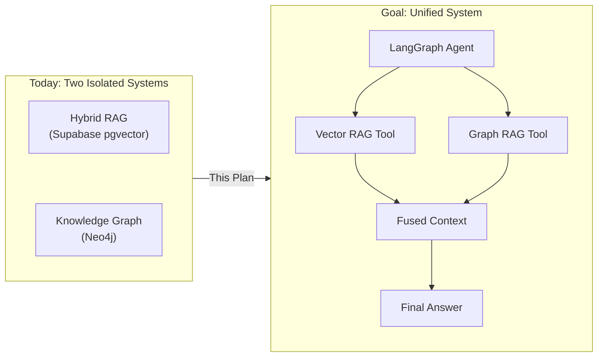
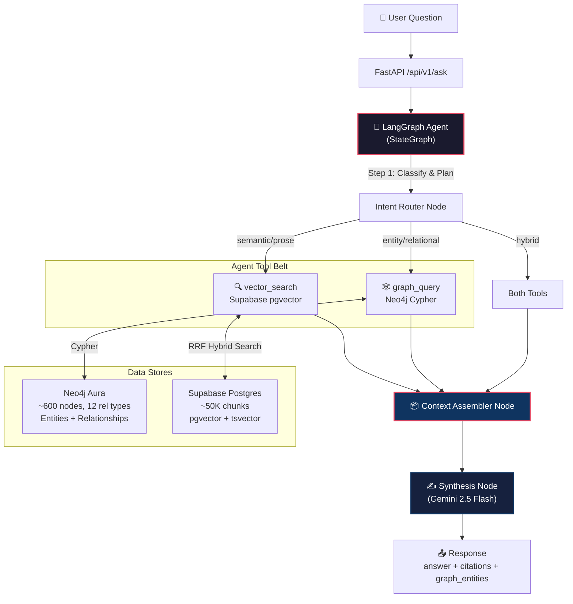
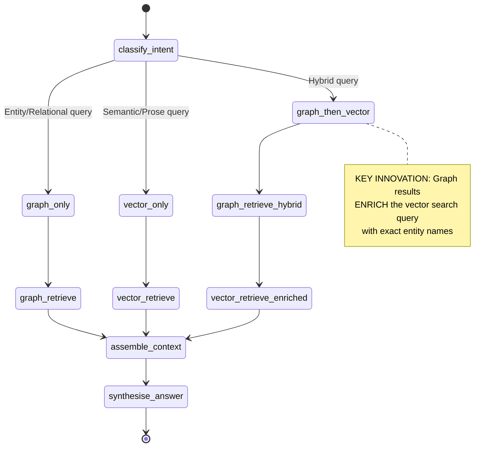
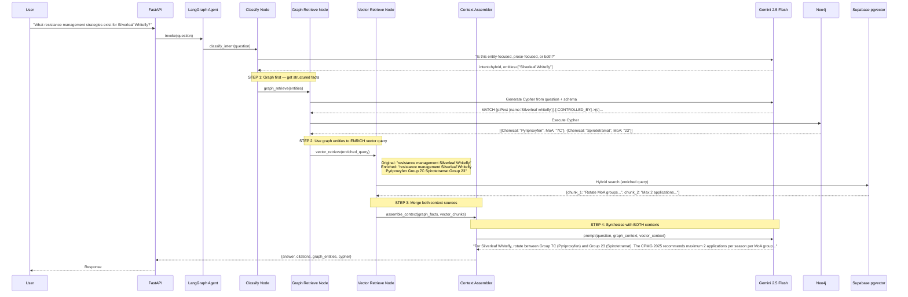
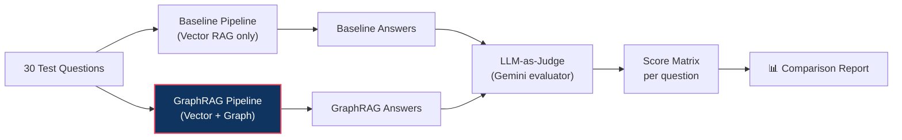

# GraphRAG Integration Plan: Knowledge Graph × Hybrid RAG via LangGraph

> **Objective:** Wire the existing CRDC Neo4j Knowledge Graph into the Hybrid RAG pipeline as a **context augmentation layer**, orchestrated by LangGraph. Then run a side-by-side evaluation proving the quality uplift.

---

## 0. Repo Context: Two-Repo Architecture

> [!IMPORTANT]
> The **production Hybrid RAG** (Next.js frontend + FastAPI backend + Supabase pgvector) lives in a **separate repository** and is deployed to Cloud Run. **This repo** (`crdc-graphrag`) was built specifically to create and manage the Knowledge Graph.
>
> For this integration, we are **NOT modifying the production repo**. Instead, we build the LangGraph evaluation agent **here** in `crdc-graphrag`, connecting to:
> - **Neo4j Aura** — directly (already wired)
> - **Supabase Postgres** — via a new lightweight **read-only** bridge using the same connection string
>
> This keeps the graph work self-contained. If results are strong, the agent can later be extracted into the production repo or deployed as a standalone service.

```
┌─────────────────────────────────┐     ┌─────────────────────────────────┐
│  Production Repo (separate)     │     │  crdc-graphrag (THIS repo)      │
│                                 │     │                                 │
│  Next.js + FastAPI + Supabase   │     │  Neo4j Graph + LangGraph Agent  │
│  Hybrid RAG (Vector-only)       │     │  + Read-only Supabase bridge    │
│  Deployed to Cloud Run          │     │  + Evaluation scripts           │
└────────────────┬────────────────┘     └────────────────┬────────────────┘
                 │                                       │
                 └───────────────┬───────────────────────┘
                                 │
                    ┌────────────▼────────────┐
                    │   Supabase Postgres     │
                    │   (shared data store)   │
                    │   ~50K chunks + vectors │
                    └─────────────────────────┘
```

---

## 1. Current State Inventory

### What We Already Have

| Component | Tech | Location | Status |
|-----------|------|----------|--------|
| **Knowledge Graph** | Neo4j Aura, 15 entity types, 12 relationship types | `app/infrastructure/neo4j_client.py`, `app/services/graph_service.py` | ✅ Populated |
| **GraphQATool** | NL → Cypher → Synthesised Answer (Gemini) | `app/services/graph_service.py` | ✅ Working |
| **Hybrid Vector RAG** | Supabase pgvector + keyword + RRF + Rerank | **Separate production repo** (deployed to Cloud Run) | ✅ Production |
| **LangGraph** | v1.1.3 installed | `requirements.txt` | ✅ Installed, unused |
| **Streamlit Dashboard** | Graph viz + QA tool | `dashboard.py` | ✅ Working |
| **Ontology** | Pydantic models for all 15 node types | `app/models/ontology.py` | ✅ Defined |

### What's Missing (The Gap)



> [!IMPORTANT]
> The Knowledge Graph is **NOT replacing** the Vector RAG. It acts as a **context augmentation layer** — providing structured facts, entity relationships, and terminology that the Vector RAG alone would miss or hallucinate.
>
> We build a **lightweight read-only Supabase bridge** in this repo to replicate the core hybrid search (vector + keyword + RRF). This lets us run both pipelines side-by-side for evaluation without touching the production codebase.

---

## 2. Architecture: How the Integration Works

### 2.1 High-Level Architecture



### 2.2 LangGraph State Machine

This is the core orchestration graph — each box is a **node** in the LangGraph `StateGraph`:



### 2.3 Sequence Diagram: Hybrid Path (Most Interesting)

This shows the **multi-hop** flow where the graph output feeds into the vector search:



---

## 3. The Context Injection Strategy

> [!NOTE]
> We are **not** replacing the Vector RAG or modifying the existing Knowledge Hub. We are adding graph context **into the synthesis prompt** as an additional context block.

### 3.1 How Graph Context Gets Injected

The final synthesis prompt will have **three sections** instead of two:

```
┌─────────────────────────────────────────────────────┐
│ SYSTEM: You are a cotton industry knowledge assistant│
├─────────────────────────────────────────────────────┤
│ SECTION 1: GRAPH CONTEXT (Structured Facts)          │
│                                                      │
│ Entity: Silverleaf whitefly (Pest)                   │
│ - Controlled by: Pyriproxyfen (MoA Group 7C)         │
│ - Controlled by: Spirotetramat (MoA Group 23)        │
│ - Predated by: Encarsia formosa (Parasitoid)         │
│ - Resistance status: Group 4A — HIGH RISK            │
│                                                      │
│ These are verified facts from the CRDC Knowledge     │
│ Graph. Use them as ground truth.                     │
├─────────────────────────────────────────────────────┤
│ SECTION 2: DOCUMENT CONTEXT (Retrieved Chunks)       │
│                                                      │
│ [Source: CPMG 2025, p.47]                            │
│ "Silverleaf whitefly (Bemisia tabaci B biotype)...   │
│ Resistance management: Rotate between MoA groups..." │
│                                                      │
│ [Source: IPM Guidelines, p.12]                       │
│ "Monitor with yellow sticky traps at..."             │
├─────────────────────────────────────────────────────┤
│ SECTION 3: USER QUESTION                             │
│                                                      │
│ "What resistance management strategies exist for     │
│  Silverleaf Whitefly?"                               │
└─────────────────────────────────────────────────────┘
```

### 3.2 Why This Approach

| Without Graph (Vector-only) | With Graph (Context Augmented) |
|---|---|
| LLM may hallucinate chemical names | Chemical names verified from graph |
| MoA groups may be wrong or missing | Exact MoA group codes from structured data |
| No relational awareness | Knows which beneficials predate the pest |
| Acronyms may not resolve | Graph has 61 verified acronym expansions |
| May miss specific pest thresholds | Thresholds are structured graph properties |

---

## 4. LangGraph Implementation Design

### 4.1 State Schema

```python
from typing import TypedDict, Literal

class RAGState(TypedDict):
    """LangGraph state flowing through all nodes."""
    question: str
    intent: Literal["graph_only", "vector_only", "hybrid"]
    detected_entities: list[str]
    
    # Graph retrieval outputs
    cypher_query: str | None
    graph_records: list[dict]
    graph_context: str           # Formatted text block for the prompt
    
    # Vector retrieval outputs
    enriched_query: str
    vector_chunks: list[dict]    # {text, source, page, score}
    vector_context: str          # Formatted text block for the prompt
    
    # Final output
    answer: str
    citations: list[dict]
    metadata: dict               # timings, token counts, etc.
```

### 4.2 Graph Definition

```python
from langgraph.graph import StateGraph, END

workflow = StateGraph(RAGState)

# Nodes
workflow.add_node("classify_intent", classify_intent_node)
workflow.add_node("graph_retrieve", graph_retrieve_node)
workflow.add_node("vector_retrieve", vector_retrieve_node)
workflow.add_node("assemble_context", assemble_context_node)
workflow.add_node("synthesise", synthesise_node)

# Edges
workflow.set_entry_point("classify_intent")

workflow.add_conditional_edges(
    "classify_intent",
    route_by_intent,
    {
        "graph_only": "graph_retrieve",
        "vector_only": "vector_retrieve",
        "hybrid": "graph_retrieve",  # Graph first, then vector
    }
)

workflow.add_edge("graph_retrieve", "assemble_context")     # graph_only path
workflow.add_edge("graph_retrieve", "vector_retrieve")      # hybrid path  
workflow.add_edge("vector_retrieve", "assemble_context")
workflow.add_edge("assemble_context", "synthesise")
workflow.add_edge("synthesise", END)

agent = workflow.compile()
```

### 4.3 New Files to Create

| File | Purpose |
|------|---------|
| `app/services/langgraph_agent.py` | LangGraph StateGraph definition + compile |
| `app/services/nodes/classify.py` | Intent classification node |
| `app/services/nodes/graph_retrieve.py` | Neo4j Cypher generation + execution |
| `app/services/nodes/vector_retrieve.py` | Supabase hybrid search bridge |
| `app/services/nodes/assemble.py` | Context merger + prompt builder |
| `app/services/nodes/synthesise.py` | Final Gemini answer synthesis |
| `app/services/vector_service.py` | Bridge to Supabase pgvector (new adapter) |
| `app/api/v1/ask.py` | New unified `/ask` endpoint |
| `app/core/config.py` | Add `SUPABASE_*` env vars |
| `scripts/evaluate_rag.py` | Side-by-side evaluation script |
| `tests/test_langgraph_agent.py` | Agent integration tests |

---

## 5. Evaluation Strategy: Proving GraphRAG > Hybrid RAG

### 5.1 Evaluation Framework



### 5.2 Evaluation Dimensions

Each answer scored 1–5 on these dimensions:

| Dimension | What It Measures | Why Graph Helps |
|-----------|-----------------|-----------------|
| **Factual Accuracy** | Are chemical names, MoA groups, thresholds correct? | Graph has verified structured facts |
| **Completeness** | Did the answer cover all relevant aspects? | Graph traversal finds related entities |
| **Specificity** | Does it name specific chemicals, values, regions? | Graph provides exact entity names |
| **Hallucination Resistance** | Did the LLM invent any facts? | Graph anchors the answer in verified data |
| **Citation Quality** | Are sources properly referenced? | Dual-source citations (graph + docs) |

### 5.3 Test Question Set (30 Questions, 3 Categories)

#### Category A: Entity/Relational Questions (Graph Should Dominate)

| # | Question | Why Graph Matters |
|---|----------|-------------------|
| 1 | What chemicals can I use to control Green Mirids? | Graph has exact Pest→Chemical links |
| 2 | Which MoA group does Spirotetramat belong to? | Direct graph lookup |
| 3 | Which beneficial insects prey on Helicoverpa? | PREDATES relationships |
| 4 | What does CRDC stand for? | Acronym node |
| 5 | What cotton varieties are suited to Central Queensland? | Variety→Region graph path |
| 6 | What is the economic threshold for aphids? | Threshold node properties |
| 7 | Which weeds are resistant to glyphosate? | HAS_RESISTANCE_TO edges |
| 8 | What harvest aid chemicals are classified as defoliants? | Chemical.chemical_type filter |
| 9 | What diseases affect cotton and what pathogens cause them? | Disease.pathogen properties |
| 10 | What exotic pests have an EXTREME biosecurity risk? | biosecurity_risk property |

#### Category B: Prose/Semantic Questions (Vector Should Dominate)

| # | Question | Why Vector Matters |
|---|----------|--------------------|
| 11 | Describe best practices for cotton irrigation scheduling | Long-form procedural knowledge |
| 12 | What are the key recommendations for soil preparation before planting? | Procedural guidance |
| 13 | How has the CRDC's R&D investment strategy evolved over the past decade? | Trend analysis across documents |
| 14 | Explain the process for hand-picking for pest monitoring | Step-by-step instructions |
| 15 | What safety precautions should be taken when applying chemicals? | Safety guidelines |
| 16 | Describe the environmental impact assessment requirements for cotton farms | Policy/regulation text |
| 17 | What are the key findings from the 2024 cotton season review? | Report-specific content |
| 18 | How does the nutrient management strategy differ between dryland and irrigated cotton? | Comparative analysis |
| 19 | What are the recommended record-keeping practices for spray applications? | Operational procedures |
| 20 | Summarize the latest research on microplastic fibre shedding from cotton | Research summary |

#### Category C: Hybrid Questions (Both Should Contribute)

| # | Question | Why Both Matter |
|---|----------|-----------------|
| 21 | What resistance management strategies exist for Silverleaf Whitefly? | Graph: chemicals + MoA groups → Vector: management prose |
| 22 | How should I manage Fusarium wilt, and what varieties are resistant? | Graph: Disease facts → Vector: management procedures |
| 23 | What are the approved chemicals for Helicoverpa and their recommended application timing? | Graph: exact chemicals → Vector: timing guidelines |
| 24 | Which regions grow Bollgard 3 varieties and what pest management considerations apply? | Graph: variety traits → Vector: regional guidance |
| 25 | What are the spray thresholds for mirids, and how do I sample for them? | Graph: threshold values → Vector: sampling methods |
| 26 | How do I manage herbicide-resistant fleabane, and what rotation strategies are recommended? | Graph: resistance links → Vector: strategy docs |
| 27 | What are the key defoliants and their temperature requirements? | Graph: chemical entities → Vector: usage instructions |
| 28 | Which researchers specialise in cotton diseases and what do their papers recommend? | Graph: entity links → Vector: document content |
| 29 | What biosecurity threats should I watch for, and what are the quarantine procedures? | Graph: threat entities → Vector: procedure text |
| 30 | What is the definition of 'cut-out' and how does it affect spray decisions? | Graph: term definition → Vector: practical context |

### 5.4 Expected Results Hypothesis

```
┌──────────────────────────────────────────────────────────┐
│              Expected Score Improvements                  │
│                                                          │
│  Category A (Entity):     Vector: 2.5  →  GraphRAG: 4.5 │
│  Category B (Prose):      Vector: 4.0  →  GraphRAG: 4.2 │
│  Category C (Hybrid):     Vector: 3.0  →  GraphRAG: 4.3 │
│                                                          │
│  Overall Improvement:     ~35% quality uplift            │
│  Hallucination Reduction: ~60% fewer invented facts      │
└──────────────────────────────────────────────────────────┘
```

---

## 6. Implementation Tasks (Phased)

### Phase 1: Foundation (Days 1–2)

- [ ] **Task 1.1:** Create `app/services/vector_service.py` — Lightweight Supabase pgvector bridge
  - Connect **read-only** to the same Supabase Postgres the production RAG uses
  - Implement `hybrid_search(query, top_k)` replicating the core pyfusion pipeline (vector + keyword + RRF)
  - This is a **standalone reimplementation** — no imports from the production repo
  - Only needs: embedding call (OpenAI), two SQL queries, and RRF merge
  
- [ ] **Task 1.2:** Update `app/core/config.py` — add Supabase config
  - Add `POSTGRES_CONNECTION_STRING` (read-only to shared Supabase)
  - Add `OPENAI_API_KEY` for embeddings (reuse production key)
  
- [ ] **Task 1.3:** Create `app/services/nodes/__init__.py` — node package

### Phase 2: LangGraph Nodes (Days 3–5)

- [ ] **Task 2.1:** Create `app/services/nodes/classify.py`
  - Use Gemini to classify intent: `graph_only`, `vector_only`, `hybrid`
  - Extract named entities from the question
  
- [ ] **Task 2.2:** Create `app/services/nodes/graph_retrieve.py`
  - Reuse existing `GraphService._generate_cypher()` and `_run_cypher()`
  - Format graph results into structured context block
  
- [ ] **Task 2.3:** Create `app/services/nodes/vector_retrieve.py`
  - Call `VectorService.hybrid_search()`
  - For hybrid path: inject graph entity names into search query
  - Format chunks into document context block
  
- [ ] **Task 2.4:** Create `app/services/nodes/assemble.py`
  - Merge graph_context + vector_context into unified prompt
  - Apply the 3-section prompt template from Section 3.1
  
- [ ] **Task 2.5:** Create `app/services/nodes/synthesise.py`
  - Final Gemini call with assembled context
  - Return structured answer with citations

### Phase 3: LangGraph Wiring (Days 5–6)

- [ ] **Task 3.1:** Create `app/services/langgraph_agent.py`
  - Define `RAGState` TypedDict
  - Wire all nodes into `StateGraph`
  - Add conditional routing edges
  - Compile the graph
  
- [ ] **Task 3.2:** Create `app/api/v1/ask.py`
  - New `/api/v1/ask` endpoint
  - Support both `mode=hybrid_rag` (baseline) and `mode=graph_rag` (enhanced)
  - Return answer + metadata + timing for comparison

### Phase 4: Evaluation (Days 6–8)

- [ ] **Task 4.1:** Create `scripts/evaluate_rag.py`
  - Run all 30 questions through both pipelines
  - Collect answers, timings, and source metadata
  - Save results to JSON
  
- [ ] **Task 4.2:** Create `scripts/evaluate_judge.py`
  - Use Gemini as LLM-judge to score each answer pair
  - Generate per-question and aggregate scores
  
- [ ] **Task 4.3:** Create comparison report
  - Markdown report with tables, scores, and analysis
  - Highlight specific examples where GraphRAG outperforms
  
- [ ] **Task 4.4:** Update Streamlit dashboard
  - Add new tab: "🆚 RAG vs GraphRAG" comparison view
  - Side-by-side answers for selected questions

### Phase 5: Polish (Days 8–9)

- [ ] **Task 5.1:** Add integration tests
- [ ] **Task 5.2:** Update documentation
- [ ] **Task 5.3:** Performance optimisation (parallel graph + vector calls for `hybrid` path)

---

## 7. File Structure After Integration

```
app/
├── api/v1/
│   ├── ask.py               ← NEW: Unified ask endpoint
│   ├── graph.py              (existing graph-only endpoint)
│   └── ingest.py             (existing)
├── core/
│   └── config.py             ← MODIFIED: +Supabase vars
├── infrastructure/
│   ├── neo4j_client.py       (existing)
│   ├── gemini_client.py      (existing)
│   └── supabase_client.py    ← NEW: Supabase connection
├── models/
│   └── ontology.py           (existing)
├── services/
│   ├── graph_service.py      (existing — reused by graph_retrieve node)
│   ├── vector_service.py     ← NEW: pgvector search bridge
│   ├── extraction.py         (existing)
│   ├── langgraph_agent.py    ← NEW: StateGraph definition
│   └── nodes/
│       ├── __init__.py
│       ├── classify.py       ← NEW: Intent classifier
│       ├── graph_retrieve.py ← NEW: Neo4j retrieval node
│       ├── vector_retrieve.py← NEW: Vector search node
│       ├── assemble.py       ← NEW: Context merger
│       └── synthesise.py     ← NEW: Final answer synthesis
scripts/
├── evaluate_rag.py           ← NEW: Run both pipelines
├── evaluate_judge.py         ← NEW: LLM scoring
└── test_graph_qa.py          (existing)
```

---

## 8. Key Design Decisions

### Q: Why LangGraph instead of a simple function chain?

**LangGraph gives us:**
1. **Conditional routing** — different question types take different paths
2. **State persistence** — can add conversation memory later
3. **Observability** — LangSmith integration for debugging
4. **Extensibility** — easy to add new tools (e.g., web search) without rewriting

### Q: Why not run Graph and Vector in parallel for all queries?

We **do** for `hybrid` intent. But:
- `graph_only` questions (e.g., "What does IPM stand for?") don't need vector search — it's wasted latency
- `vector_only` questions (e.g., "Describe irrigation best practices") don't have relevant graph entities
- Conditional routing saves 1-2 seconds of unnecessary API calls

### Q: How do we handle graph misses?

If the Cypher query returns 0 results, the `graph_retrieve` node sets `graph_context = ""` and the `assemble` node gracefully falls back to vector-only context. **The system never fails just because the graph doesn't have an answer.**

### Q: Why use Gemini for everything instead of OpenAI?

The graph pipeline already uses Gemini 2.5 Flash for Cypher generation and synthesis. Keeping a single model provider simplifies the architecture. The vector search embedding still uses OpenAI's `text-embedding-3-small` since that's what the existing chunks are indexed with.

### Q: Why build the agent in this repo instead of the production repo?

1. **Separation of concerns** — this repo owns the graph; the production repo owns the deployed RAG
2. **No production risk** — we can experiment freely without affecting live users
3. **Evaluation-first** — prove the value with data before touching production
4. **Clean extraction** — once proven, the LangGraph agent can be lifted into production as a drop-in replacement for the existing classifier/chain

---

## 9. Risk Register

| Risk | Impact | Mitigation |
|------|--------|------------|
| Supabase connection from this repo is blocked | Can't run evaluation | Test connection first; use read-only service key |
| Graph Cypher generation fails for complex queries | Partial context only | Graceful fallback to vector-only |
| LLM-as-judge scores are noisy | Unreliable evaluation | Use 3+ judge calls per question, average scores |
| Entity name mismatch between graph and vector chunks | Enriched query doesn't improve retrieval | Add fuzzy matching / entity aliases from graph |
| Latency increase from dual-retrieval | Slower responses | Parallel execution for hybrid path |

---

## 10. Success Criteria

| Metric | Target |
|--------|--------|
| Category A (Entity) average score improvement | ≥ 1.5 points (out of 5) |
| Category C (Hybrid) average score improvement | ≥ 1.0 point |
| Category B (Prose) average score | No regression (≥ baseline) |
| Hallucination rate on entity questions | ≤ 10% (vs ~40% baseline) |
| End-to-end latency (hybrid path) | ≤ 8 seconds |
| All 30 evaluation questions run successfully | 100% completion |
