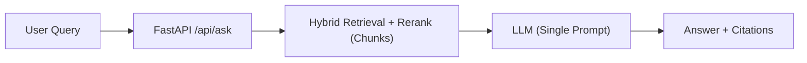
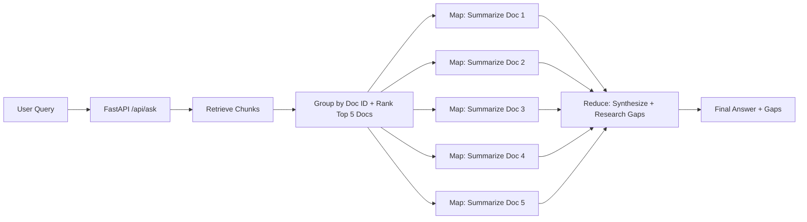
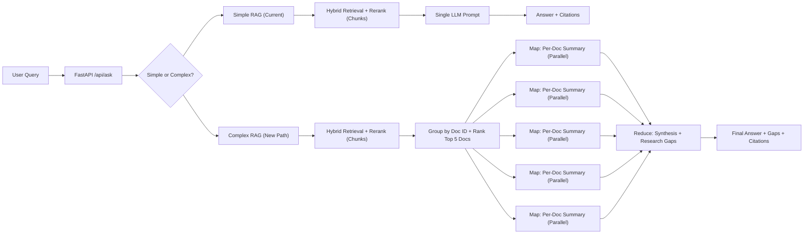

# Complex Query Methods (CRDC Knowledge Hub)

## Purpose

This document compares complex-query techniques (Map-Reduce, Refine, LangGraph), defines the scope of “complex” questions, explains the routing score, and clarifies why “just use a bigger model” is not enough. It also includes a clear RAG explanation and system diagrams.

## Current Architecture (Baseline)

Single-stage RAG:

- Retrieve chunks (hybrid search + rerank)
- Send chunks to one LLM prompt
- Return answer + citations

This is fast and works for “single-fact” or “single-section” questions. It underperforms on tasks that require multi-document synthesis or explicit comparison.

## Scope: Types of Complex Queries

Complex queries are not just “long questions.” They are questions that require multi-step reasoning across multiple documents, or explicit synthesis, comparison, or gap analysis. Typical scopes:

- Multi-document synthesis: “Summarize the top 5 reports on X and identify research gaps.”
- Cross-document comparison: “Compare how Y is measured across reports.”
- Conflict detection: “Find inconsistencies in recommendations about Z.”
- Trend/timeline: “How has guidance changed since 2015?”
- Structured output: “Build a decision matrix / taxonomy / table from reports.”

These require doc-level grouping, aggregation, and a synthesis stage. A single prompt over chunks is usually insufficient.

## Technique Comparison (Side-by-Side)

### Map-Reduce

Flow: summarize each document independently (map) → combine summaries into synthesis (reduce).

Pros:

- Parallelizable (lower latency)
- Stable structure across docs
- Good for “top N docs + gaps”

Cons:

- Reduce step can miss nuance unless carefully prompted
- Requires doc-level grouping and per-doc summaries

### Refine

Flow: start with doc1 summary → iteratively refine using doc2, doc3, etc.

Pros:

- Coherent narrative across docs
- Natural for “evolving summary”

Cons:

- Order-dependent (early mistakes propagate)
- Sequential (higher latency)

### LangGraph (Orchestrator)

LangGraph is not a summarization method; it is a workflow engine.

Pros:

- Clean routing (simple vs complex)
- Fan-out/fan-in for map-reduce
- State, retries, observability

Cons:

- More moving parts than a simple chain
- Not required if you only need fixed steps

## Routing Heuristic (No Classifier Needed)

We use a score-based rule and route to complex if the score is high enough.

Scoring signals:

- Multi-document intent keywords (compare, across, trend, gap, inconsistent, synthesize) = +2
- Explicit doc quantity (top 5, 3 reports, “across reports”) = +2
- Output format (matrix, table, taxonomy, gap analysis) = +1
- Time range (since 2015, last decade, 1986–2024) = +1
- Query length > 20 words = +1; > 35 words = +2

Threshold:

- Score >= 3 => complex
- Score < 3 => simple

Example score calculation:
“Summarize the top 5 CRDC final reports on soil carbon and identify research gaps.”

- Multi-doc intent (+2)
- Explicit quantity (+2)
- Gap analysis (+1)
Total = 5 → route to complex

## Why “Just Use a Bigger Model” Is Not Enough

Your client’s idea (“if complex, send to a better model”) improves reasoning, but does NOT fix missing evidence. The real issue is usually retrieval and synthesis, not just model strength.

Typical failure modes if you only upgrade the model:

- It still sees chunks, not full document context.
- It lacks doc-level grouping and cross-doc synthesis.
- It can hallucinate “gaps” without structured evidence.

Model upgrades can improve phrasing and reasoning, but you still need multi-step workflow for complex queries.

## How RAG Works (Short, Clear Explanation)

RAG = Retrieval-Augmented Generation.

1) Retrieval: Convert the question into a vector and fetch relevant chunks from the database (semantic + keyword search).
2) Context assembly: Gather the best chunks (optionally rerank or deduplicate).
3) Generation: Send the question + retrieved chunks to the LLM, which answers using that context.
4) Citations: Return the answer and references to source chunks/pages.

RAG improves factual grounding, but it is still limited by the context you feed the LLM. If the task requires multi-document synthesis, you must add a multi-step layer on top of retrieval.

## Quality vs Latency Tradeoffs

Simple RAG:

- Latency: low
- Quality: good for simple answers, poor for synthesis

Map-Reduce:

- Latency: moderate (parallel map, single reduce)
- Quality: strong for structured synthesis

Refine:

- Latency: higher (sequential)
- Quality: coherent narrative but order-dependent

LangGraph:

- Latency: depends on graph design
- Quality: improves control and reliability

## System Diagrams

### Current Architecture (Single-Stage)

### Map-Reduce (Top 5 Docs + Gaps)

### Refine (Top 5 Docs + Gaps)

```mermaid
flowchart LR
  U["User Query"] --> API["FastAPI /api/ask"]
  API --> RET["Retrieve Chunks"]
  RET --> GROUP["Group by Doc ID + Rank Top 5 Docs"]
  GROUP --> STEP1["Initial Answer from Doc 1"]
  STEP1 --> STEP2["Refine with Doc 2"]
  STEP2 --> STEP3["Refine with Doc 3"]
  STEP3 --> STEP4["Refine with Doc 4"]
  STEP4 --> STEP5["Refine with Doc 5 + Gaps"]
  STEP5 --> OUT["Final Answer + Gaps"]
```

### Combined Architecture (Routing)

## Where This Fits in Your Codebase

- API entrypoint: app/api/routers/ask.py
- Pipeline factory: app/factory.py
- Retrieval and fusion: rag/chain.py, rag/retrieval/fusion.py, app/infrastructure/adapters/vector_postgres.py
- Doc-level grouping and synthesis: new module (not yet implemented)

## Summary

Complex queries require more than a stronger model. They need doc-level grouping, multi-step synthesis, and explicit reasoning over multiple sources. Map-Reduce and Refine are deterministic ways to do this; LangGraph is an orchestration layer that makes routing and fan-out/fan-in workflows easier to manage.
