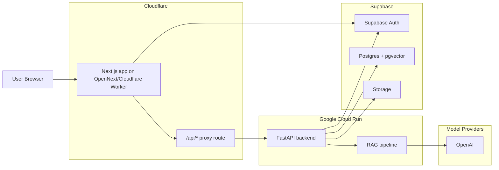
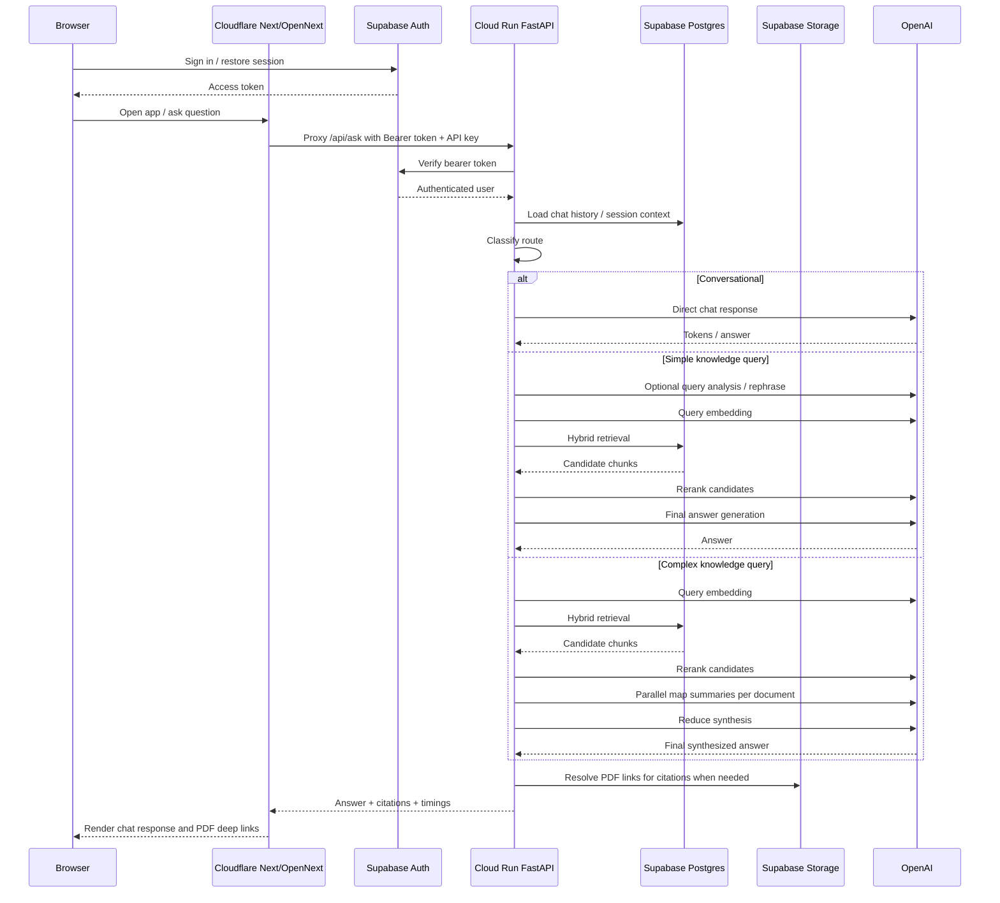
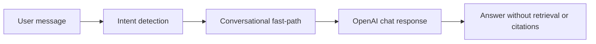
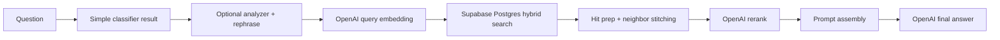
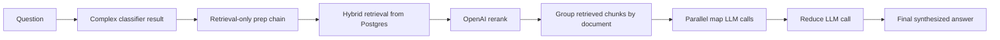
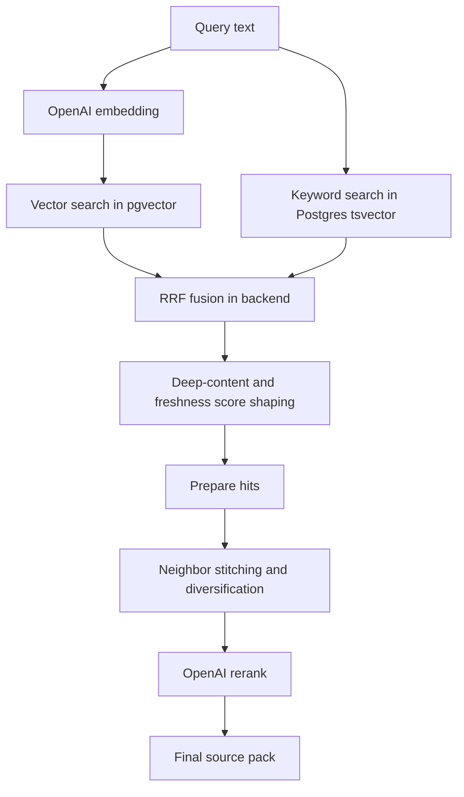
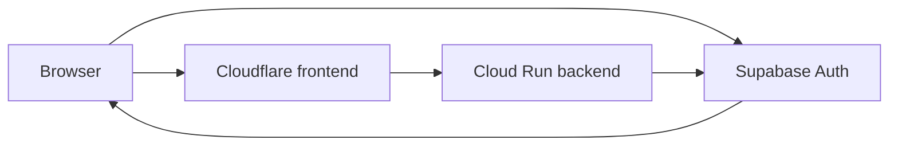
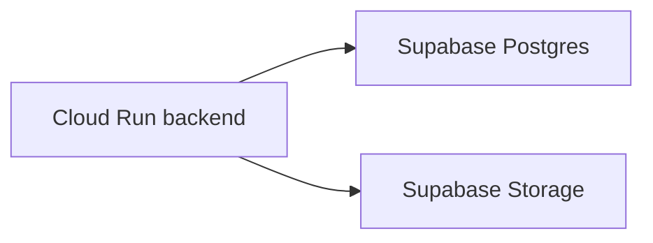

# Current Runtime RAG Architecture

This document shows the current end-to-end runtime architecture for the Knowledge Hub:
- how traffic moves through Cloudflare, Cloud Run, and Supabase
- where LLM calls happen
- how conversational, simple, and complex questions take different paths

This intentionally excludes ingestion details.

## 1. Deployment Topology

## 2. What Runs Where

| Layer | Current role |
| --- | --- |
| Cloudflare | Hosts the Next.js frontend via OpenNext and runs the `/api/*` proxy route |
| Cloud Run | Runs the FastAPI backend and all RAG orchestration |
| Supabase Auth | Handles login/session issuance |
| Supabase Postgres | Stores documents, chunks, chat history, metadata, and vector embeddings |
| Supabase Storage | Serves PDFs and related stored assets through backend-controlled routes |
| OpenAI | Embeddings, reranking, query rewriting, conversational responses, and final answer generation |

## 3. Important Current-State Notes

1. The frontend is clearly wired for Cloudflare.
   Evidence in repo:
   - `frontend/wrangler.jsonc`
   - `frontend/open-next.config.ts`
   - `frontend/package.json` Cloudflare deploy scripts

2. The backend is clearly wired for Cloud Run.
   Evidence in repo:
   - `deploy/manual_deploy_api.sh`
   - `deploy/deploy_public.yaml`
   - `deploy/Dockerfile.api`

3. Browser auth is direct to Supabase, but application data calls are proxied through the frontend.
   - Browser gets a Supabase session token
   - frontend sends `Authorization: Bearer ...`
   - backend verifies the bearer token with Supabase admin credentials

4. The repo contains both Cloudflare frontend config and an older containerized web build path.
   - The Cloudflare/OpenNext path looks like the intended frontend runtime
   - the Docker-based web build still exists in the repo as an alternate or older deployment path

5. The implemented LLM runtime is effectively OpenAI today.
   - `configs/runtime/gemini.yaml` exists
   - but `app/factory.py` currently instantiates `OpenAIAdapter` directly for the LLM path
   - so Gemini is not fully wired as a live generation backend in the current code path

## 4. End-to-End Request Flow

## 5. Where LLMs Are Used

This is the key runtime view.

| Stage | Used in which path | Model/provider role |
| --- | --- | --- |
| Conversational reply | Conversational only | Direct LLM answer, no retrieval |
| Query analyzer | Some multi-turn knowledge queries | Small routing/extraction model call |
| Query rephrase | Knowledge queries with chat history | Rewrite follow-up into standalone retrieval query |
| Query embedding | Simple and complex knowledge queries | OpenAI embedding for retrieval |
| Reranking | Simple and complex knowledge queries | OpenAI embeddings scored against candidate chunks |
| Final answer generation | Simple knowledge queries | Main answer synthesis |
| Map step | Complex knowledge queries | One LLM call per selected document |
| Reduce step | Complex knowledge queries | Final cross-document synthesis |

## 6. Runtime Paths

### A. Conversational path

Used for:
- greetings
- thanks
- chat-meta questions
- requests like "what did I ask before?"
- simple clarification turns that do not require retrieval

Flow:
- `/api/ask`
- detect conversational intent
- skip retrieval
- call LLM directly
- return answer without citations

### B. Simple knowledge path

Used for:
- normal factual document-backed questions
- single-topic queries
- most standard RAG requests

Flow:
- authenticate user
- load chat history
- classify as non-conversational
- classify as simple
- optional query analysis
- optional query rewrite
- embed query
- run hybrid retrieval in Postgres
- prepare and diversify hits
- rerank
- build prompt with citations
- generate final answer

### C. Complex knowledge path

Used for:
- compare/synthesize/across-many-documents questions
- trends, gaps, overlap, ranking, multi-report summaries

Flow:
- authenticate user
- classify as complex
- run retrieval-only prep chain first
- convert citations into chunk payloads
- group chunks by document
- run parallel map LLM calls
- run one reduce synthesis call
- return synthesized answer with citations

## 7. Retrieval Architecture

The active knowledge path is hybrid retrieval over Supabase Postgres.

Current runtime flow:
1. query embedding is generated with OpenAI
2. backend runs parallel vector and keyword search
3. backend fuses results with Reciprocal Rank Fusion
4. backend applies hit preparation, preview construction, neighbor stitching, and per-doc diversification
5. backend reranks with OpenAI embeddings
6. top sources go into prompt assembly

## 8. Auth and Data Flow

The auth/data split matters because the browser does not talk directly to the application database.

### Auth flow

Meaning:
- login/session is managed with Supabase in the frontend
- the frontend attaches the bearer token to API calls
- the backend validates the bearer token using Supabase admin access

### Data flow

Backend responsibilities:
- query `documents`, `chunks`, and chat/session tables in Postgres
- resolve internal PDF URLs and signed/storage-backed document access
- return citations with PDF deep-link metadata

## 9. Streaming Behavior

Streaming is split into phases so the UI can show citations early.

Simple streaming:
1. retrieve sources
2. emit `sources`
3. stream answer tokens

Complex streaming:
1. retrieve sources
2. emit `sources`
3. emit map-reduce status messages
4. stream reduce output

## 10. Current Component Responsibility Map

| Concern | Main file |
| --- | --- |
| Cloudflare API proxy | `frontend/src/app/api/[...path]/route.ts` |
| Backend origin wiring | `frontend/src/lib/server-api.ts` |
| Frontend auth token attachment | `frontend/src/lib/auth-client.ts` |
| Supabase browser auth client | `frontend/src/lib/supabase/client.ts` |
| Bearer verification in backend | `app/api/deps.py` |
| Main ask endpoint | `app/api/routers/ask.py` |
| Pipeline assembly | `app/factory.py` |
| Retrieval/prompt chain | `rag/chain.py` |
| Complexity routing | `rag/routing/classifier.py` |
| Postgres hybrid retrieval | `app/infrastructure/adapters/vector_postgres.py` |
| Reranker | `app/infrastructure/adapters/rerank_openai.py` |
| Complex map-reduce | `rag/synthesis/map_reduce.py` |

## 11. Bottom Line

The current runtime architecture is:
- Cloudflare-hosted Next.js frontend
- frontend proxying `/api/*` to a Cloud Run FastAPI backend
- Supabase handling auth, Postgres, and storage
- OpenAI handling every implemented LLM/embedding/rerank step in the active code path

The three runtime behaviors are:
- conversational: direct LLM, no retrieval
- simple: standard hybrid RAG + rerank + single final generation
- complex: hybrid RAG + rerank + map-reduce synthesis
