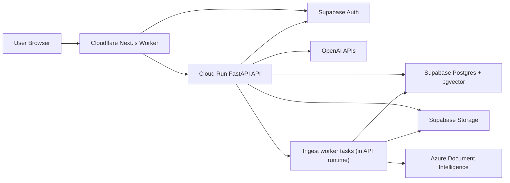
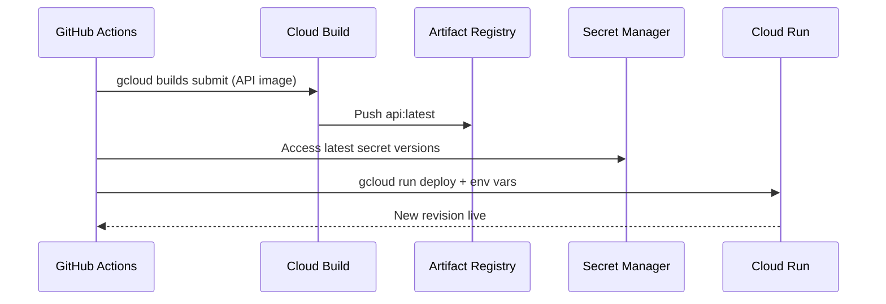

# Hybrid Production Architecture (GCP + Supabase + Cloudflare)

Last updated: 2026-03-11

This document describes the current hybrid production architecture, how deployment works, what services run where, how secrets are managed, and the main operational challenges.

## 1. Why Hybrid

The platform is intentionally split:
- Cloudflare for edge-hosted frontend and API proxying
- GCP (Cloud Run) for Python/FastAPI compute
- Supabase for managed Auth, Postgres/pgvector, and Storage

## 2. Service Placement

| Platform | Services in use | Role |
| --- | --- | --- |
| Cloudflare | OpenNext Worker runtime (`frontend/wrangler.jsonc`) | Serves Next.js app and edge API proxy routes |
| GCP | Cloud Run (`knowledge-hub-api`), Cloud Build, Artifact Registry, Secret Manager | Runs FastAPI backend and deployment pipeline |
| Supabase | Auth, Postgres (`chunks`, `documents`, chat/session tables), Storage (`raw_pdfs`, `assets`) | Identity, persistence, vector search data, PDF/assets |
| OpenAI | Embeddings, reranking, answer generation, analyzer/rephrase paths | Active model provider in runtime code path |
| Azure | Document Intelligence | PDF parse/layout extraction during ingestion |

## 3. Topology

## 4. Deployment Workflows (Current)

### API deployment (GCP)

Current repo flow:
1. GitHub Actions workflow (`.github/workflows/deploy-api.yml`) authenticates to GCP.
2. Cloud Build builds/pushes API image via `deploy/cloudbuild_api_only.yaml`.
3. Deployment script `deploy/manual_deploy_api.sh`:
   - fetches secrets from Secret Manager
   - deploys Cloud Run service with env vars

### Frontend deployment (Cloudflare)

Frontend is wired for OpenNext + Wrangler:
- build/deploy scripts in `frontend/package.json` (`opennextjs-cloudflare build/deploy`)
- runtime config in `frontend/wrangler.jsonc`

Note: this repo does not currently include a dedicated GitHub Actions workflow for frontend Cloudflare deploy.

## 5. Secrets Management (Current State)

### Where secrets are stored

- Primary backend secret source: GCP Secret Manager (`deploy/gcp_setup.sh` seeds core secrets).
- Frontend/runtime secrets: expected in Cloudflare Worker environment (for `API_ORIGIN`, `API_KEY`) and/or CI/CD environment.

### How secrets are injected today

- API deploy script reads secrets with `gcloud secrets versions access latest ...`.
- Those values are then injected into Cloud Run via `--set-env-vars`.
- Backend reads them from environment (`API_KEY`, `ADMIN_API_KEY`, `SUPABASE_SERVICE_ROLE_KEY`, `OPENAI_API_KEY`, `POSTGRES_CONNECTION_STRING`, etc.).

### Secret-related implementation notes

1. Supabase public keys (`NEXT_PUBLIC_SUPABASE_*`) are intentionally public client credentials.
2. Backend falls back across multiple Supabase env key names (`SUPABASE_SERVICE_ROLE_KEY`, `SUPABASE_SERVICE_KEY`, etc.) for compatibility.
3. PDF signed URL generation uses backend Supabase service credentials.

## 6. Production Challenges (Observed)

1. Split deployment paths for frontend:
   - Cloudflare OpenNext path is active.
   - Older container-based web build path still exists (`deploy/cloudbuild.yaml` + `frontend/Dockerfile`), which can create ambiguity.
2. Cloud Run IAM update limitation observed during deploy:
   - documented warning around missing `run.services.setIamPolicy` capability for deploy identity.
3. Secret injection model uses plain env-var deployment:
   - secrets are fetched then passed via `--set-env-vars`, rather than direct Cloud Run secret references.
4. Ingestion execution shares API runtime:
   - background ingestion tasks run in-process with API service, which can increase contention under load.
5. Filter UX/API mismatch:
   - retrieval supports `subjects`, but `AskFilters` schema currently does not expose direct client `subjects` input.
6. Freshness scoring technical debt:
   - retrieval freshness decay currently uses a hardcoded year baseline (`2025`) instead of current year calculation.

## 7. How We Mitigate Today

1. App-level auth controls remain enforced even when Cloud Run is publicly invokable:
   - API key middleware
   - bearer token verification and domain checks
   - admin allowlist checks
2. Retrieval latency controls:
   - pyfusion hybrid search default
   - bounded overfetch and rerank limits
   - stream prep timeout safeguards
3. Deployment reproducibility:
   - deterministic Dockerfile for API
   - pinned Cloud Build configs and deploy script in repo

## 8. Recommended Hardening Next

1. Move Cloud Run secret injection from `--set-env-vars` to native secret references (`--set-secrets`).
2. Standardize on one frontend production deployment path and archive/remove legacy path docs/scripts.
3. Isolate ingestion workers from request-serving API runtime (separate job/service).
4. Expose `subjects` in public ask filter schema for explicit client-side control.
5. Replace hardcoded freshness baseline year with dynamic current-year logic.
