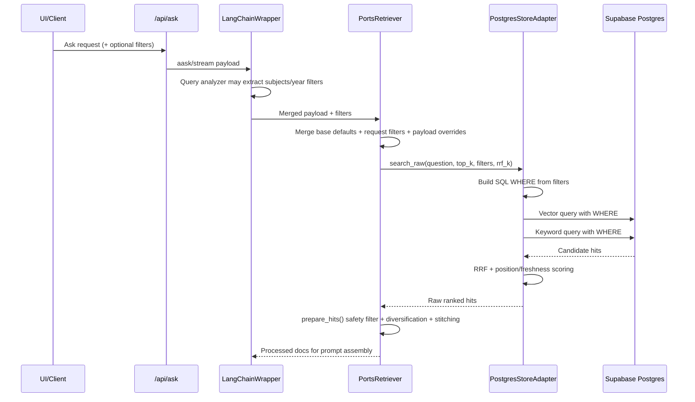
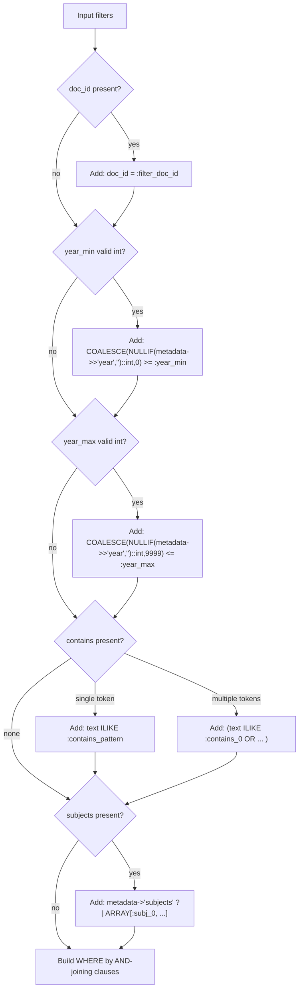

# Metadata Filtering Architecture

Last updated: 2026-03-11

This document describes how metadata filtering currently works in retrieval, including filter extraction, merge rules, SQL pushdown, and post-processing.

## 1. Supported Retrieval Filters

Current retrieval engine supports these metadata filters:

| Filter key | Meaning | Applied where |
| --- | --- | --- |
| `doc_id` | Restrict to one document | SQL WHERE |
| `year_min` | Earliest publication year | SQL WHERE + post-filter safety |
| `year_max` | Latest publication year | SQL WHERE + post-filter safety |
| `contains` | Text contains one or more terms | SQL WHERE (`ILIKE`) + post-filter safety |
| `subjects` | Any-of subject tags (`metadata->'subjects'`) | SQL WHERE (`?|`) + post-filter safety |
| `neighbors` | Neighbor stitching window | Retrieval post-processing |
| `per_doc` | Max chunks per doc | Retrieval post-processing |
| `diversify_per_doc` | Enable/disable per-doc diversification | Retrieval post-processing |

## 2. End-to-End Filter Flow

## 3. Filter Sources

### A. Explicit API filters

`/api/ask` accepts `filters` in request payload via `AskFilters`:
- `year_min`, `year_max`, `contains`
- `neighbors`, `per_doc`, `max_preview_chars`, `max_snippet_chars`, `diversify_per_doc`

### B. Query-analyzer extracted filters

For conversational-history aware requests, `LangChainWrapper._analyze_query()` can extract:
- `subjects`
- `year_min`
- `year_max`

These extracted filters are merged into the active payload before retrieval.

### C. Retriever defaults/config

Retriever seeds default behavior from runtime/config:
- default diversification and per-doc behavior
- default neighbor stitching
- default preview/snippet size limits

## 4. Filter Merge Rules (Current)

Merge order inside retrieval path:

1. Base retriever filters (`PortsRetriever` internal defaults)
2. Incoming payload `filters` dict
3. Top-level payload overrides for known keys (`contains`, `year_min`, `year_max`, `neighbors`, `per_doc`, etc.)
4. Default fallbacks for preview/snippet char limits if absent

Net effect: request/pipeline payload wins over static defaults.

## 5. SQL Pushdown Logic

`PostgresStoreAdapter._build_filter_clause()` builds a shared WHERE clause used by both vector and keyword search queries.

## 6. Hybrid Retrieval + Filtering Behavior

- Vector and keyword searches both receive the same filter clause.
- Results are fused with RRF in Python (`search_hybrid_pyfusion` default path).
- Final score currently includes:
  - RRF score
  - front-matter position penalty
  - freshness boost/decay from metadata year when present

## 7. Post-Retrieval Safety Filtering

After SQL retrieval, `prepare_hits()` in `rag/retrieval/utils.py` applies `passes_filters()` again.

Why this exists:
- protects behavior if a store backend does not enforce all filters uniformly
- keeps filtering behavior consistent across future retrieval modes
- ensures per-doc caps/diversification and neighbor stitching are applied centrally

## 8. Library Filters vs Retrieval Filters

Library UI filter endpoint (`/api/library/filters`) currently returns unique years only.

This is separate from retrieval-time metadata filtering and is used for library browsing UX, not full RAG retrieval control.

## 9. Current Constraints and Gaps

1. `subjects` is extracted by query-analyzer flow, but is not currently exposed in the `AskFilters` schema for direct client control.
2. Year filtering assumes `metadata->>'year'` is parseable to int when present.
3. Freshness decay uses chunk metadata year; missing/invalid year values bypass decay logic.
