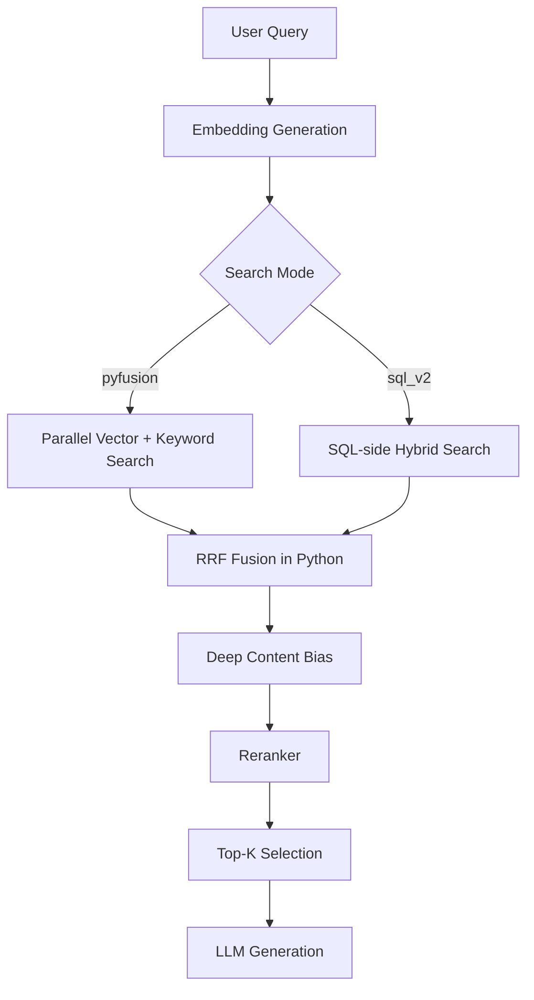

# RAG Retrieval Pipeline Deep-Dive

This document explains every step of the Knowledge Hub's retrieval pipeline, including algorithm details, configuration options, and performance considerations.

---

## 1. High-Level Pipeline Flow



---

## 2. Step-by-Step Algorithm

### Step 1: Query Embedding Generation

**File**: `app/infrastructure/adapters/vector_postgres.py`

```python
async def _get_embedding():
    query_hash = hashlib.md5(query_text.encode()).hexdigest()
    cached = self._get_cached_embedding(query_hash)
    if cached:
        return cached  # LRU cache hit
    
    emb = await self._embed_query(query_text)  # OpenAI API call
    self._set_cached_embedding(query_hash, emb)
    return emb
```

| Detail | Value |
|--------|-------|
| Model | `text-embedding-3-small` (via OpenAI) |
| Dimensions | 1536 |
| Cache | In-memory LRU (1000 entries) |
| Latency | ~300-600ms (API call); <1ms (cache hit) |

---

### Step 2: Parallel Database Search (V3 Mode)

**File**: `app/infrastructure/adapters/vector_postgres.py` → `search_hybrid_pyfusion()`

Two independent queries run **concurrently**:

#### 2a. Vector Search (Semantic Similarity)

```sql
SELECT id, doc_id, chunk_index, page_number, text, metadata,
       1 - (embedding <=> CAST(:embedding AS vector)) as score
FROM chunks
WHERE /* metadata filters */
ORDER BY embedding <=> CAST(:embedding AS vector)
LIMIT 60
```

| Component | Description |
|-----------|-------------|
| Operator | `<=>` = Cosine Distance (pgvector) |
| Index | HNSW (`chunks_embedding_idx`, m=16, ef_construction=64) |
| Score | `1 - distance` = cosine similarity (0 to 1) |

#### 2b. Keyword Search (Full-Text)

```sql
SELECT id, doc_id, chunk_index, page_number, text, metadata,
       ts_rank_cd(search_vector, plainto_tsquery('english', :query_text)) as score
FROM chunks
WHERE search_vector @@ plainto_tsquery('english', :query_text)
      AND /* metadata filters */
ORDER BY score DESC
LIMIT 60
```

| Component | Description |
|-----------|-------------|
| Function | `ts_rank_cd` = Cover Density ranking |
| Index | GIN (`chunks_search_vector_idx`) |
| Tokenizer | English `plainto_tsquery` |

---

### Step 3: Metadata Filtering

**File**: `app/infrastructure/adapters/vector_postgres.py` → `_build_filter_clause()`

Filters are applied **at query time** (pushed to database):

| Filter | SQL Clause |
|--------|------------|
| `doc_id` | `doc_id = :filter_doc_id` |
| `year_min` | `COALESCE(NULLIF(metadata->>'year', '')::int, 0) >= :year_min` |
| `year_max` | `COALESCE(NULLIF(metadata->>'year', '')::int, 9999) <= :year_max` |
| `contains` | `text ILIKE '%token%'` (multiple tokens use OR) |

**Example**: Filtering for 2020+ documents:

```python
filters = {"year_min": 2020}
# Produces: WHERE COALESCE(NULLIF(metadata->>'year', '')::int, 0) >= 2020
```

---

### Step 4: Reciprocal Rank Fusion (RRF)

**File**: `app/infrastructure/adapters/vector_postgres.py` → `search_hybrid_pyfusion()`

RRF combines rankings from vector and keyword searches:

```python
rrf_score = 0.0
if v_rank:
    rrf_score += 1.0 / (rrf_k + v_rank)  # rrf_k = 60 by default
if k_rank:
    rrf_score += 1.0 / (rrf_k + k_rank)
```

**Formula**: `RRF(d) = Σ 1/(k + rank(d))`

| Parameter | Default | Effect |
|-----------|---------|--------|
| `rrf_k` | 60 | Higher = less aggressive fusion |
| Limit | `top_k * 4` (min 60) | Overfetch to ensure diversity |

**Example RRF Calculation**:

| Chunk | Vector Rank | Keyword Rank | RRF Score |
|-------|-------------|--------------|-----------|
| A | 1 | 5 | 1/61 + 1/65 = 0.0318 |
| B | 3 | 1 | 1/63 + 1/61 = 0.0322 |
| C | 2 | - | 1/62 = 0.0161 |

Chunk B wins despite not being #1 in either list.

---

### Step 5: Deep Content Bias (Front-Matter Penalty)

Penalizes pages likely to be abstracts, TOC, or title pages:

```python
if page_number <= 2:
    boost = 0.7   # 30% penalty
elif page_number <= 4:
    boost = 0.85  # 15% penalty
else:
    boost = 1.0   # No penalty

final_score = rrf_score * boost
```

| Page | Penalty | Rationale |
|------|---------|-----------|
| 1-2 | 30% | Title page, abstract |
| 3-4 | 15% | TOC, acknowledgments |
| 5+ | 0% | Main body content |

---

### Step 6: Reranking (OpenAI Embeddings)

**File**: `app/infrastructure/adapters/rerank_openai.py`

After retrieval, the reranker refines scores using query-document similarity:

```python
# 1. Embed query + all candidate texts in one batch
batch = [query] + [chunk.text for chunk in candidates]
vectors = openai.embeddings.create(model="text-embedding-3-small", input=batch)

# 2. Compute cosine similarity
q_vec = vectors[0]
doc_vecs = vectors[1:]
scores = doc_vecs @ q_vec  # Dot product (normalized = cosine)

# 3. Re-sort by new scores
```

| Parameter | Default | Description |
|-----------|---------|-------------|
| `topn` | 20 | Max candidates to rerank |
| `truncate_chars` | 1200 | Truncate long texts before embedding |
| Model | `text-embedding-3-small` | Embedding model |

**Latency**: ~800-1500ms (depends on candidate count).

---

### Step 7: Top-K Selection

After reranking, the final `k` results are selected:

```python
# Config: k = 6 (from configs/runtime/openai.yaml)
final_results = reranked_results[:k]
```

| Config Key | Value | Description |
|------------|-------|-------------|
| `retrieval.k` | 6 | Final sources sent to LLM |
| `retrieval.per_doc` | 4 | Max chunks per document |
| `retrieval.diversify_per_doc` | true | Spread results across docs |

---

### Step 8: Neighbor Stitching (Optional)

**File**: `app/infrastructure/adapters/vector_postgres.py` → `get_neighbor_chunks()`

For context continuity, adjacent chunks can be fetched:

```python
async def get_neighbor_chunks(doc_id, chunk_index, window=1):
    """Fetch chunks [index-window, index+window] for same document."""
    stmt = text("""
        SELECT id, doc_id, chunk_index, text, metadata
        FROM chunks
        WHERE doc_id = :doc_id
          AND chunk_index BETWEEN :start AND :end
        ORDER BY chunk_index
    """)
```

| Parameter | Default | Description |
|-----------|---------|-------------|
| `SEARCH_NEIGHBOR_WINDOW` | 0 | 0 = disabled; 1 = ±1 chunk |

**When Enabled (window=1)**:

- Chunk 5 → Returns chunks 4, 5, 6
- Increases context for LLM

---

## 3. Configuration Reference

### Environment Variables

| Variable | Default | Description |
|----------|---------|-------------|
| `SEARCH_MODE` | `pyfusion` | `pyfusion` (V3), `sql_v2`, or legacy |
| `SEARCH_V2` | `false` | Force SQL-based fusion |
| `SEARCH_NEIGHBOR_WINDOW` | `0` | Neighbor stitching window |

### Runtime Config (`configs/runtime/openai.yaml`)

```yaml
retrieval:
  k: 6              # Final results count
  per_doc: 4        # Max chunks per document
  rerank: true      # Enable reranker
  mode: dense       # dense, sparse, or hybrid
```

---

## 4. Performance Characteristics

| Stage | Typical Latency | Notes |
|-------|-----------------|-------|
| Embedding (cache miss) | 300-600ms | OpenAI API call |
| Embedding (cache hit) | <1ms | LRU cache |
| Vector Search | 50-200ms | HNSW index |
| Keyword Search | 50-200ms | GIN index |
| RRF Fusion | <1ms | In-memory Python |
| Deep Bias | <1ms | Simple multiplication |
| Reranking | 800-1500ms | OpenAI batch embedding |
| **Total (no rerank)** | **~400-800ms** | Cache hit path |
| **Total (with rerank)** | **~1.5-2.5s** | Full pipeline |

> **Note**: Network latency to Supabase adds ~200-400ms per DB round-trip depending on region.

---

## 5. Algorithm Comparison

| Aspect | V3 (pyfusion) | V2 (sql_v2) |
|--------|---------------|-------------|
| Execution | Parallel Python | Single SQL CTE |
| RRF | Python dict merge | SQL FULL OUTER JOIN |
| Deep Bias | O(1) heuristic | O(n) subquery per doc |
| Latency | Lower | Higher |
| Complexity | Simple | Complex |
