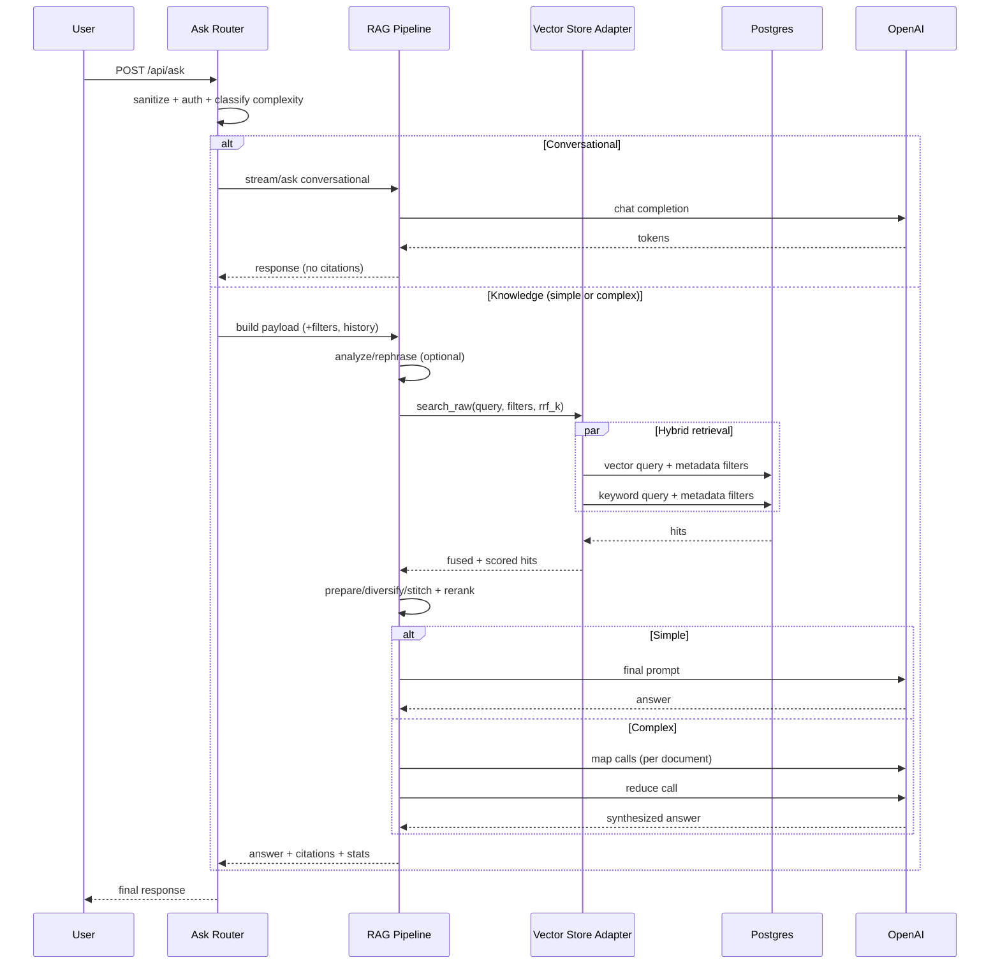

# System Architecture: RAG Pipeline

Last updated: 2026-03-11

This document describes the **application-level RAG architecture** (query understanding, retrieval, ranking, synthesis, citations).  
It intentionally does **not** focus on cloud deployment topology.

## 1. RAG Architecture Diagram

```mermaid
flowchart LR
    Q["User Question"] --> S0["Input Sanitization + Session Context"]
    S0 --> R0{"Intent + Complexity Routing"}

    R0 -->|"Conversational"| C0["Direct Conversational LLM Path"]
    C0 --> OUT["Streamed Response"]

    R0 -->|"Knowledge (Simple/Complex)"| A0["Query Analyzer (optional) + Rephrase"]
    A0 --> F0["Filter Merge (defaults + request + extracted filters)"]
    F0 --> E0["Query Embedding"]

    F0 --> SQLF["SQL Metadata Filter Pushdown"]
    E0 --> V0["Vector Search (pgvector)"]
    A0 --> K0["Keyword Search (tsvector)"]
    SQLF --> V0
    SQLF --> K0

    V0 --> RRF["RRF Fusion"]
    K0 --> RRF
    RRF --> SCORE["Score Shaping (position + freshness)"]
    SCORE --> PREP["Hit Prep (filter safety, diversify, neighbors, preview)"]
    PREP --> RR["Embedding Reranker (optional)"]
    RR --> CIT["Citation Pack (doc_id, page, bboxes, URL)"]

    CIT --> BR{"Synthesis Path"}
    BR -->|"Simple"| G0["Single-pass Answer Generation"]
    BR -->|"Complex"| M0["Map-Reduce Synthesis"]
    G0 --> OUT
    M0 --> OUT
```

## 2. End-to-End Pipeline

### Stage 0: Request normalization

- Sanitize user text.
- Load short chat history window when session exists.
- Initialize runtime payload (k, rerank, filters, token limits).

### Stage 1: Routing

Routing determines one of three paths:

1. Conversational path: no retrieval, direct LLM response.
2. Knowledge-simple path: standard retrieval + rerank + single synthesis.
3. Knowledge-complex path: retrieval + rerank + map-reduce synthesis.

### Stage 2: Query understanding

For knowledge paths:

- Optional query analyzer classifies intent and may extract filters (`subjects`, `year_min`, `year_max`).
- Optional query rephrase rewrites follow-up turns to standalone retrieval queries.

### Stage 3: Candidate retrieval

Retrieval is hybrid:

1. Vector search on `embedding` (cosine distance via pgvector).
2. Keyword search on `search_vector` (Postgres full-text).
3. Both queries run in parallel and are fused with Reciprocal Rank Fusion (RRF).

### Stage 4: Metadata-aware scoring

Filters are pushed into SQL before ranking:

- `doc_id`
- `year_min`, `year_max`
- `contains`
- `subjects` (array match on metadata)

After fusion, scoring adds:

- front-matter/position penalty for early pages
- freshness shaping when year metadata is available

### Stage 5: Hit preparation

Prepared hit set includes:

- per-doc diversification
- neighbor stitching around chunk boundaries
- preview/snippet construction
- citation metadata enrichment (page/bboxes/source URL)

### Stage 6: Synthesis

#### Simple synthesis

- Prompt assembly from top hits.
- Single LLM generation pass.

#### Complex synthesis

- Group chunks by document.
- Parallel map calls per document.
- Reduce call to synthesize cross-document answer.

### Stage 7: Output

API output includes:

- answer text (streaming or buffered)
- citations with `doc_id`, `page`, `bboxes`, and PDF URL
- timings/retrieval stats metadata when available

## 3. Sequence Diagram (Detailed)

## 4. Key Components

| Concern | Primary implementation |
| --- | --- |
| Ask endpoint and routing | `app/api/routers/ask.py` |
| Pipeline factory/wrapper | `app/factory.py` |
| LCEL chain + prep chain | `rag/chain.py` |
| Hybrid retrieval adapter | `app/infrastructure/adapters/vector_postgres.py` |
| Retriever merge/filter behavior | `rag/retrievers/ports.py` |
| Hit processing and safety filtering | `rag/retrieval/utils.py` |
| Fusion behavior | `rag/retrieval/fusion.py` |
| Reranking | `app/infrastructure/adapters/rerank_openai.py` |
| Complex map-reduce synthesis | `rag/synthesis/map_reduce.py` |

## 5. Related Docs

- Runtime traffic/deployment topology: `docs/CURRENT_RAG_PIPELINE.md`
- Retrieval algorithm deep dive: `docs/RETRIEVAL_PIPELINE.md`
- Metadata filtering internals: `docs/METADATA_FILTERING_ARCHITECTURE.md`
