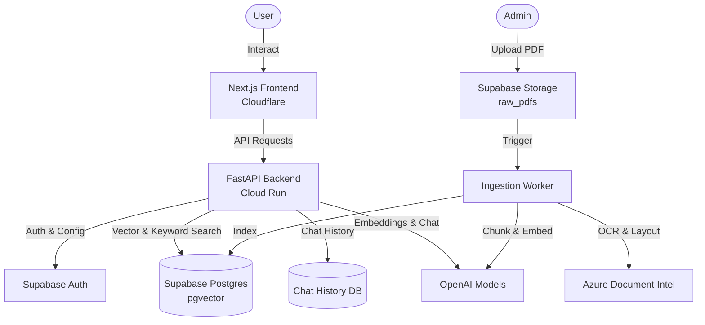
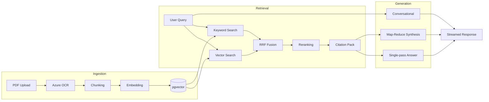

# CRDC Knowledge Hub: Technical Architecture

## The Business Problem & Scope

The CRDC (Cotton Research and Development Corporation) has accumulated over **2,000 documents** spanning **40+ years** of agricultural research — project reports, field trial data, travel summaries, and technical evaluations. This corpus represents an enormous body of institutional knowledge, but it is effectively unsearchable. Researchers, agronomists, and industry professionals waste countless hours manually sifting through dense PDFs to find specific methodologies, past project outcomes, or domain-specific insights.

The Knowledge Hub is an intelligent, document-grounded AI search application built on Retrieval-Augmented Generation (RAG). It ingests, processes, and accurately retrieves information from this entire corpus, providing users with synthesized, fully cited answers in natural language. The goal is to transform a static, unsearchable archive into an interactive, conversational knowledge base that accelerates research and decision-making across the Australian cotton industry.

## System Architecture Design

The platform is built on a modern, best-of-breed hybrid cloud architecture, deliberately splitting workloads across specialized providers for optimal performance.

## Core RAG Pipeline Flow

## Key Engineering Decisions

### 1. Hybrid Retrieval Strategy & Metadata Filtering

Agricultural data is dense. It contains complex terminology, acronyms, and project codes. A pure vector search (semantic) would miss crucial exact-match precision, while a pure keyword search would miss context.

We implemented a hybrid retrieval approach that runs vector similarity search (via pgvector) and full-text keyword search (via Postgres `tsvector`) concurrently. The results are intelligently merged using Reciprocal Rank Fusion (RRF).

**Advanced Metadata Filtering:**
To guarantee precision, we heavily rely on metadata filtering (`year_min`, `year_max`, exact `doc_id`, `subjects`, and `contains`). Quality retrieval engines don't just filter results *after* searching; they push filters down into the database layer.

- **SQL Pushdown:** Our `PostgresStoreAdapter` dynamically builds a shared SQL `WHERE` clause (using JSONB operations like `metadata->>'year'` and `metadata->'subjects' ?| ARRAY[...]`) that is applied inside Postgres *before* both the vector and keyword searches execute.
- **Dynamic Extraction:** Our query analyzer can automatically extract filters (like subjects or year ranges) from the user's conversational history and inject them into the retrieval payload.
- **Safety Filtering:** After raw hits are scored via RRF (and penalized for front-matter position or freshness), a secondary Python-level safety filter (`prepare_hits`) verifies compliance, applies per-document diversification caps, and handles neighbor chunk stitching.

### 2. High-Fidelity Deep Linking

One of the most critical UX requirements in a research tool is trust. Every LLM response is aggressively grounded in source texts. During the Azure Document Intelligence ingestion phase, we extract not just text, but pixel-perfect layout coordinates. At serving time, we package chunk metadata with exact page numbers and bounding boxes. This allows our frontend to implement robust deep linking: when a user clicks a citation, the UI instantly snaps to and highlights the exact passage in the original embedded PDF.

### 3. Adaptive Synthesis Paths

Not all user queries require the maximum level of heavy compute. Our backend routes requests intelligently based on intent and complexity:

- **Conversational Path:** Bypasses retrieval entirely for greetings and meta-chat, saving latency and token compute.
- **Standard Knowledge Path:** The default RAG pipeline—retrieve sources, optionally rerank, build the prompt, and stream the synthesis.
- **Complex Synthesis Path:** For broad analytical questions (e.g., comparing multiple years of reports), we employ a map-reduce pipeline. It retrieves broader context, groups chunks by document, executes parallel map calls per document, and reduces the results into a cohesive final answer.

## Architectural Tradeoffs

Engineers working on this codebase will encounter several explicit tradeoffs we made to optimize for accuracy, speed, and capability:

- **Mixed Sync/Async Persistence:** The backend is async-first for retrieval and API serving (crucial for I/O bound RAG concurrency), but still relies on sync SQLAlchemy for legacy chat history. We currently use threadpools to isolate blocking DB work, but unifying standard DB access onto `asyncpg` is an ongoing migration.
- **Multi-Cloud vs. Monolith:** We utilize Cloudflare, GCP, Supabase, Azure, and OpenAI. This "best-of-breed" approach drastically improves specific capabilities (e.g., Azure's OCR is unparalleled for complex tables), but introduces network latency hops and requires robust secret and boundary management.
- **Latency vs. Precision:** RRF, deep reranking, and dynamic map-reduce synthesis dramatically improve answer quality over flat vanilla RAG, but they inherently add latency. We combat this perceived slowness by aggressively streaming JSON-safe token and citation events back to the client the millisecond they are available.

## What We're Building Next

As we scale the platform, our engineering focus shifts towards increasing platform maturity and extending our AI capabilities:

- **Knowledge Graphs:** We are moving beyond pure 1D semantic chunking. Our next frontier is building and navigating Knowledge Graphs (extracting structured entities and relationships from PDFs) to enable complex, multi-hop reasoning over the entire corpus.
- **Decoupled Ingestion:** Extracting the ingestion workflow into dedicated, asynchronously scaling worker pools to completely isolate heavy processing from user-facing search traffic.
- **Model Agnosticism:** Expanding our LLM abstraction layers to seamlessly hot-swap between multiple AI providers (OpenAI, Anthropic, Gemini) based on cost, speed, and reasoning capabilities.

*This system is a production-hardened AI architecture. It is designed to be pragmatic, highly performant, and deeply focused on delivering accurate, verifiable knowledge.*
